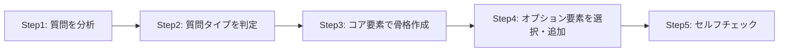
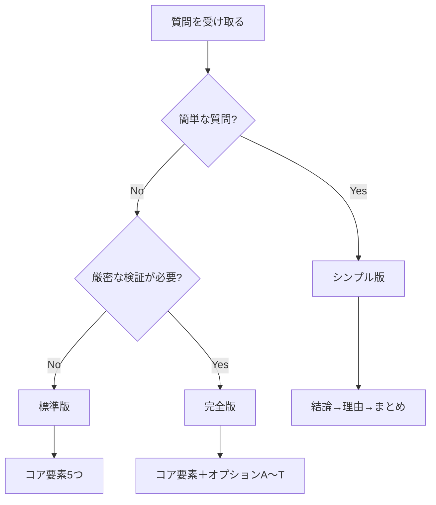
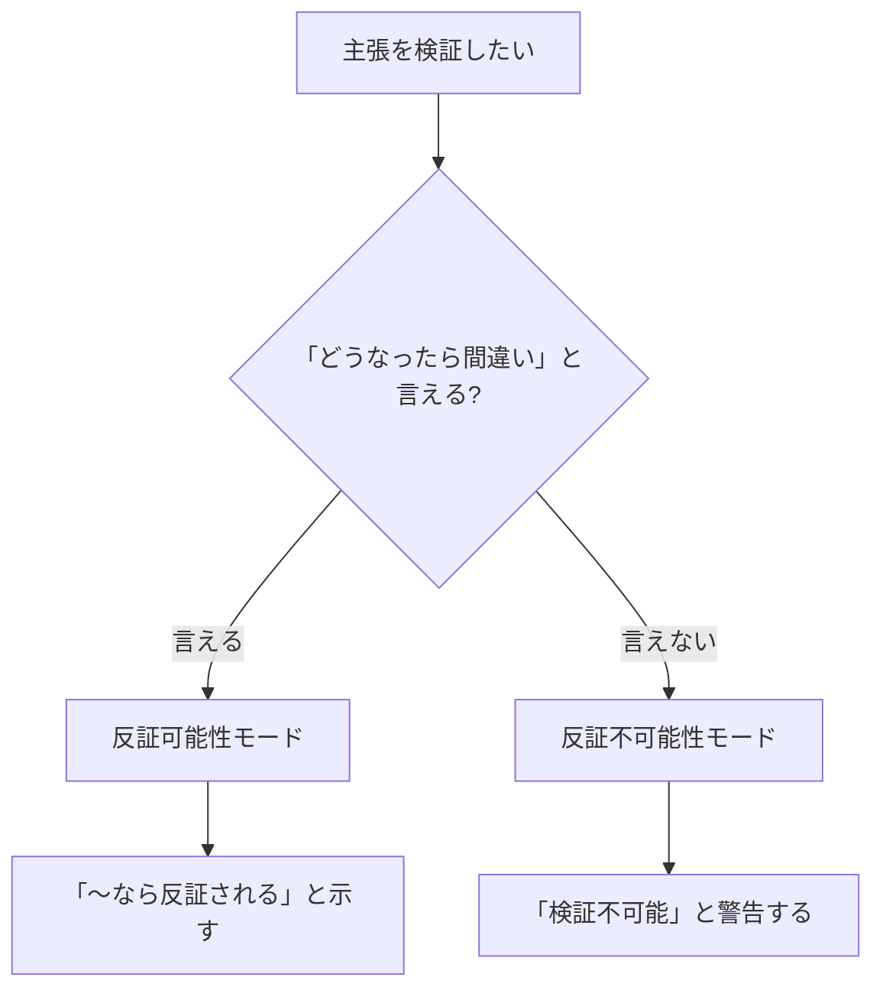
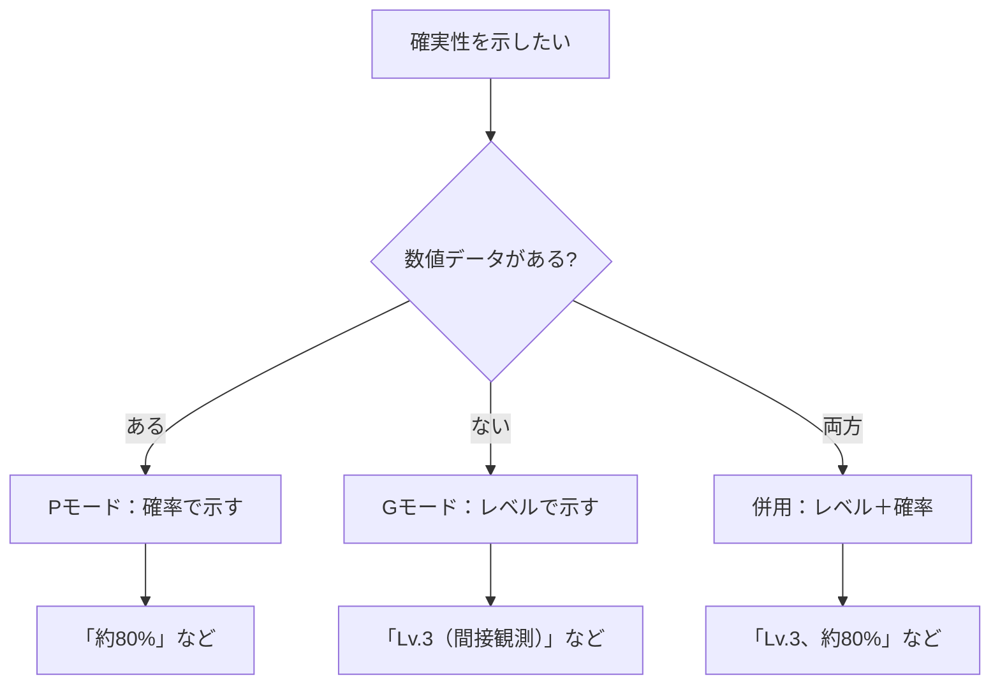

## 付録A 使い方ガイド（詳細版）

### A-1. 本付録の目的

本付録では、CASLSを実際に使用するための具体的な手順とコツを解説する。

### A-2. 基本的な使用手順

CASLSを使った回答作成は、以下の5ステップで行う。

#### Step1: 質問を分析する

まず、質問の内容を正確に把握する。

|確認事項|質問例|
|---|---|
|何を聞いているか|事実？方法？意見？比較？|
|誰が聞いているか|専門家？初心者？|
|どの程度の深さが必要か|簡潔に？詳細に？|
|時間的制約はあるか|急ぎ？じっくり？|

#### Step2: 質問タイプを判定する

質問を以下のタイプに分類する。

| タイプ      | 特徴              | 例                    |
| -------- | --------------- | -------------------- |
| 事実確認     | 〜は何か、〜はどうなっているか | 「日本の人口は？」            |
| 説明・解説    | 〜とは何か、なぜ〜か      | 「量子力学とは？」            |
| 比較・選択    | AとBどちらが、〜の違いは   | 「PythonとJavaどちらが良い？」 |
| 意見・考察    | 〜についてどう思うか      | 「AIの未来はどうなる？」        |
| 方法・手順    | どうすれば〜できるか      | 「プログラミングの始め方は？」      |
| 科学的検証    | 〜は本当か、〜は正しいか    | 「この研究結果は信頼できる？」      |
| 理論評価     | 〜という理論は妥当か      | 「この仮説は検証可能？」         |
| 倫理・政策    | 〜すべきか           | 「安楽死は認められるべき？」       |
| 予測・リスク評価 | 〜はどうなるか、〜のリスクは  | 「来年の市場はどうなる？」        |
| 複合・その他   | 上記の組み合わせ        | 「～の歴史と今後の展望は？」       |

#### Step3: コア要素で骨格を作成する

5つのコア要素を順に埋めていく。

|順序|要素|作成のコツ|
|---|---|---|
|1|結論（端的に）|最初に「答え」を1〜2文で書く|
|2|前提|「何を前提としているか」を明示する|
|3|理由・論理|「なぜそう言えるか」を論理的に説明する|
|4|結論（詳細版）|「具体的にどうするか」を示す|
|5|総括|「要するに何が重要か」でまとめる|

#### Step4: オプション要素を選択・追加する

質問タイプに応じて、必要なオプションを追加する。

|質問タイプ|推奨オプション|
|---|---|
|事実確認|C（根拠）、G/P（観測レベル／確率）|
|説明・解説|A（仮説）、C（根拠）、K（分類）、O（省略）|
|比較・選択|B（別案）、D（比較）、S（統合）|
|意見・考察|E（考察）、H（整合性vs検証）、N（価値判断）|
|方法・手順|B（別案）、J（注意点）、O（省略）|
|科学的検証|F（反証可能性）、G/P（観測レベル／確率）、H（整合性vs検証）|
|理論評価|F（反証可能性）、H（整合性vs検証）、I（自己完結性）|
|倫理・政策|N（価値判断）、E（考察）、J（注意点）|
|予測・リスク評価|A（仮説）、G/P（観測レベル／確率）、T（鮮度）|

#### Step5: セルフチェックする

付録Bのチェックシートを使って、回答を確認する。

### A-3. 版の使い分け

状況に応じて、3つの版を使い分ける。

|版|構成|所要時間|適した場面|
|---|---|---|---|
|シンプル版|結論→理由→まとめ|短い|日常会話、簡単な質問、急ぎの場合|
|標準版|コア要素5つ|中程度|通常の質問、ビジネス、説明|
|完全版|コア要素＋オプション|長い|学術的議論、重要な意思決定、厳密な検証|

### A-4. 版ごとの実践例

同じ質問に対して、3つの版で回答する例を示す。

**質問：「早起きは健康に良いですか？」**

---

#### シンプル版

**結論：** はい、一般的に良いとされています。

**理由：** 朝の光を浴びることで体内時計がリセットされ、睡眠の質が向上するためです。

**まとめ：** 規則正しい生活リズムを作る意味で、早起きは健康に良い習慣です。

---

#### 標準版

**1. 結論（端的に）：** はい、多くの研究で健康への良い影響が報告されています。

**2. 前提：** ここでいう「早起き」は、午前6〜7時頃に起床することを指します。また「健康」は、身体的・精神的な健康状態を含みます。

**3. 理由・論理：** 早起きが健康に良いとされる理由は主に3つあります。第一に、朝の光を浴びることで体内時計（サーカディアンリズム）がリセットされ、夜の睡眠の質が向上します。第二に、朝食を摂る時間が確保され、代謝が活性化します。第三に、朝の時間に余裕ができることで、精神的なストレスが軽減されます。

**4. 結論（詳細版）：** 具体的には、毎日同じ時間に起床し、起床後30分以内に自然光を浴びることが推奨されます。ただし、睡眠時間を削って早起きすることは逆効果です。7〜8時間の睡眠時間を確保した上での早起きが重要です。

**5. 総括：** まとめると、早起きは健康に良い習慣ですが、十分な睡眠時間の確保が前提条件です。

---

#### 完全版

**1. 結論（端的に）：** はい、多くの研究で健康への良い影響が報告されています。ただし、個人差があります。

**2. 前提：** ここでいう「早起き」は、午前6〜7時頃に起床することを指します。また「健康」は、身体的・精神的な健康状態を含みます。なお、クロノタイプ（朝型・夜型）の個人差が存在することを前提とします。

**3. 理由・論理：** 早起きが健康に良いとされる理由は主に3つあります。第一に、朝の光を浴びることで体内時計（サーカディアンリズム）がリセットされ、夜の睡眠の質が向上します。第二に、朝食を摂る時間が確保され、代謝が活性化します。第三に、朝の時間に余裕ができることで、精神的なストレスが軽減されます。

**4. 結論（詳細版）：** 具体的には、毎日同じ時間に起床し、起床後30分以内に自然光を浴びることが推奨されます。ただし、睡眠時間を削って早起きすることは逆効果です。7〜8時間の睡眠時間を確保した上での早起きが重要です。

**5. 総括：** まとめると、早起きは健康に良い習慣ですが、十分な睡眠時間の確保が前提条件です。

**【オプション要素】**

**C. 根拠・補足：** ハーバード大学の研究（2021年）では、早起きの習慣がある人はうつ病のリスクが23%低いと報告されています。  
※本実践例は架空のデータを使用しています。実際の回答では正確な出典を使用してください。

**G/P. 観測・検証のレベル／確率：** この主張はLv.3（間接観測）に基づいています。複数の大規模調査で統計的に相関が確認されており、確率的には約80%の人に当てはまると推定されます。

※ 「早起きが健康に良い」は大規模調査による統計的相関（間接的な証拠）であり、因果関係の直接観測ではないため、Lv.3が適切。

※本実践例のG/P数値も架空のデータです。実際の回答では根拠に基づいた数値を使用してください。

**J. 注意点・制約・適用範囲：** 以下の点に注意が必要です。

- 夜型のクロノタイプを持つ人には、無理な早起きがストレスになる場合がある
- シフトワーカーなど、生活リズムが不規則な人には単純に適用できない
- 睡眠障害がある場合は、専門医への相談が優先される

**M. 定義の多義性：** 「早起き」の定義は文化や個人によって異なります。

- 一般的定義：午前6〜7時頃の起床
- 極端な早起き：午前4〜5時の起床（効果は研究により異なる）
- 相対的定義：普段より1〜2時間早い起床

**N. 価値判断の分離：**

- 事実：早起きと健康指標には相関がある（研究データ）
- 価値判断：「早起きすべきである」は個人の生活スタイルや価値観に依存する

**T. 情報の鮮度・耐用期間：** この情報は基礎的な生理学に基づいており、数年以上有効です。ただし、最新の睡眠研究によって推奨が変わる可能性はあります。

---

### A-5. よくあるつまずきと対策

|つまずき|原因|対策|
|---|---|---|
|何から書けばいいかわからない|質問の分析不足|Step1に戻って質問を再分析|
|コア要素が埋まらない|知識不足または質問の曖昧さ|調査するか、質問を明確化|
|オプションを選べない|質問タイプの判定ミス|A-2の質問タイプ表を再確認|
|時間がかかりすぎる|完璧を求めすぎ|版を下げる（完全版→標準版→シンプル版）|
|回答が長くなりすぎる|オプションの使いすぎ|本当に必要なオプションだけに絞る|
|G/PのPモードで困る|数値根拠がない|Gモードに切り替える|
|省略すべきか迷う|判断基準が不明確|読み手のレベルと目的を再確認|

### A-6. リバーシブル仕様の使い方

#### F要素の使い方

**例：**

| 主張          | モード       | 表現                          |
| ----------- | --------- | --------------------------- |
| 「この薬は効く」    | 反証可能性モード  | 「効かない患者がいれば反証される」           |
| 「運命は決まっている」 | 反証不可能性モード | 「どんな結果も『運命だった』と言えるため、検証不可能」 |

#### G/P要素の使い方

**例：**

|状況|モード|表現|
|---|---|---|
|統計データあり|Pモード|「成功率は約75%です」|
|経験的な判断|Gモード|「Lv.2（理論的整合性）です」|
|両方示したい|併用|「Lv.3（間接観測）、確率的には約85%」|

---
