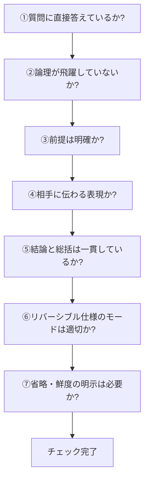

## 付録B セルフチェックシート

### B-1. 本付録の目的

本付録では、CASLSを使って作成した回答の品質を自己確認するためのチェックシートを提供する。回答を出力する前に、このシートで確認することで品質を担保できる。

### B-2. コア要素チェックシート

各コア要素が適切に機能しているかを確認する。

#### B-2-1. 結論（端的に）のチェック

|No.|チェック項目|✅|
|---|---|---|
|1|質問に直接答えているか||
|2|最初の1〜2文で結論を述べているか||
|3|YES/NOまたは核心が明確か||
|4|曖昧な表現（「場合による」等）で逃げていないか||
|5|結論（詳細版）と矛盾していないか||

#### B-2-2. 前提のチェック

|No.|チェック項目|✅|
|---|---|---|
|1|議論の範囲が明確か||
|2|重要な用語が定義されているか||
|3|暗黙の前提を明示しているか||
|4|時点・状況・立場が必要に応じて示されているか||
|5|相手が同意できる前提か||

#### B-2-3. 理由・論理のチェック

|No.|チェック項目|✅|
|---|---|---|
|1|「なぜ」が説明されているか||
|2|論理の飛躍がないか||
|3|循環論法になっていないか||
|4|感情ではなく論理で説明しているか||
|5|必要に応じて根拠が示されているか||

#### B-2-4. 結論（詳細版）のチェック

|No.|チェック項目|✅|
|---|---|---|
|1|具体的で実践に使える内容か||
|2|端的な結論を補完しているか||
|3|情報過多で要点が埋もれていないか||
|4|条件分岐が必要な場合、それが示されているか||
|5|端的な結論と矛盾していないか||

#### B-2-5. 総括のチェック

|No.|チェック項目|✅|
|---|---|---|
|1|全体の要点が整理されているか||
|2|新しい情報を追加していないか||
|3|単なる繰り返しになっていないか||
|4|次のステップや示唆があるか（必要な場合）||
|5|締めくくりとして機能しているか||

### B-3. オプション要素チェックシート

使用したオプション要素が適切に機能しているかを確認する。

#### B-3-1. 論理・検証系（A, F, G/P, H, I）のチェック

|No.|チェック項目|対象|✅|
|---|---|---|---|
|1|仮説であることが明示されているか|A||
|2|反証可能な条件が示されているか（反証可能性モード）|F||
|3|反証不可能な主張に警告を出しているか（反証不可能性モード）|F||
|4|観測・検証のレベルが明示されているか（Gモード）|G/P||
|5|確率に数値根拠があるか（Pモード）|G/P||
|6|GモードとPモードの選択は適切か|G/P||
|7|整合性と検証を区別しているか|H||
|8|循環論法がないか確認したか|I||

#### B-3-2. 比較・選択系（B, D, S）のチェック

|No.|チェック項目|対象|✅|
|---|---|---|---|
|1|代替案が実際に実行可能か|B||
|2|偽の二択になっていないか|B||
|3|比較の観点が明確か|D||
|4|公平な比較になっているか|D||
|5|比較結果から結論が導けるか|D||
|6|統合案に根拠があるか|S||
|7|統合によって失われるものを明示したか|S||
|8|安易な折衷案になっていないか|S||

#### B-3-3. 補足・深掘り系（C, E, K）のチェック

|No.|チェック項目|対象|✅|
|---|---|---|---|
|1|根拠の信頼性は十分か|C||
|2|出典が必要な場合、示されているか|C||
|3|考察が事実から離れすぎていないか|E||
|4|考察であることが明示されているか|E||
|5|分類の基準が明確か|K||
|6|分類がMECE（漏れなく重複なく）か|K||

#### B-3-4. 文脈・認識系（J, L, M, N, O, T）のチェック

|No.|チェック項目|対象|✅|
|---|---|---|---|
|1|重要な注意点・制約が示されているか|J||
|2|適用範囲の限界が明確か|J||
|3|歴史・経緯が議論に関連しているか|L||
|4|多義的な言葉の意味が整理されているか|M||
|5|事実と価値判断が分離されているか|N||
|6|価値判断を事実として提示していないか|N||
|7|省略した内容が明示されているか|O||
|8|省略の理由が示されているか|O||
|9|省略を免罪符にしていないか|O||
|10|情報の耐用期間が示されているか|T||
|11|耐用期間の見積もりに根拠があるか|T||

### B-4. 全体チェックシート

回答全体の品質を確認する。

|No.|チェック項目|✅|
|---|---|---|
|1|質問に対する答えになっているか||
|2|論理的に一貫しているか||
|3|相手のレベルに合った表現か||
|4|長すぎず短すぎず適切な長さか||
|5|必要な情報が漏れていないか||
|6|不要な情報が含まれていないか||
|7|読みやすい構造になっているか||
|8|誤字脱字がないか||
|9|リバーシブル仕様のモード選択は適切か||
|10|追加要素（O, S, T）を適切に使用したか||

### B-5. クイックチェックフロー

時間がない場合は、以下の7項目だけを確認する。

|No.|クイックチェック項目|✅|
|---|---|---|
|1|質問に直接答えているか||
|2|論理が飛躍していないか||
|3|前提は明確か||
|4|相手に伝わる表現か||
|5|結論と総括は一貫しているか||
|6|リバーシブル仕様のモードは適切か||
|7|省略・鮮度の明示は必要か||

### B-6. 判定基準

チェック結果に基づいて、回答の品質を判定する。

|判定|基準|アクション|
|---|---|---|
|✅ 合格|全項目クリア、または軽微な問題のみ|そのまま回答を出力|
|⚠️ 要改善|複数の項目に問題あり|問題箇所を修正してから出力|
|❌ 再作成|コア要素に重大な問題あり|最初から作り直す|

### B-7. リバーシブル仕様専用チェックシート

リバーシブル仕様を使用した場合の追加チェック。

#### B-7-1. F要素のチェック

|No.|チェック項目|✅|
|---|---|---|
|1|モード選択の根拠は明確か||
|2|反証可能性モード：反証条件を具体的に示したか||
|3|反証不可能性モード：警告を明示したか||
|4|疑似科学を科学的と誤認していないか||

#### B-7-2. G/P要素のチェック

|No.|チェック項目|✅|
|---|---|---|
|1|モード選択の根拠は明確か||
|2|Gモード：Lv.1〜4のどれかを明示したか||
|3|Pモード：数値の根拠があるか||
|4|Pモード：偽の精度になっていないか||
|5|併用モード：GとPの関係を説明したか||

---
