## 付録D 質問タイプ判定フローチャート

### D-1. 本付録の目的

本付録では、質問のタイプを判定し、適切なオプション要素を選択するためのフローチャートを提供する。

### D-2. 質問タイプ判定フロー

質問を受け取ったら、以下のフローに従ってタイプを判定する。

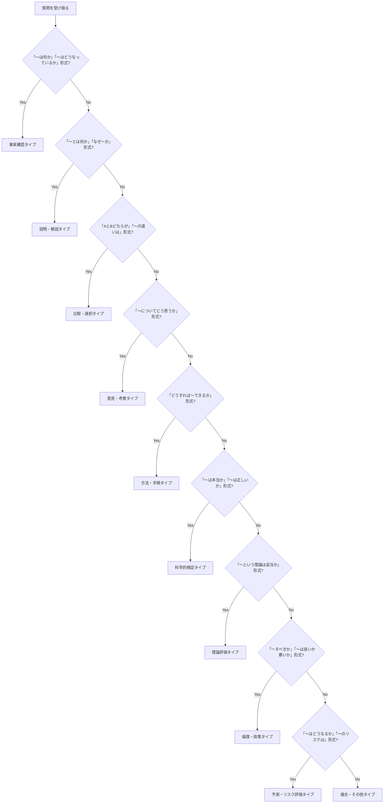

### D-3. 質問タイプ一覧と特徴

|タイプ|特徴|質問例|キーワード|
|---|---|---|---|
|事実確認|客観的な事実を問う|「日本の人口は？」「首都はどこ？」|何、どこ、いつ、誰、いくつ|
|説明・解説|概念や理由を問う|「量子力学とは？」「なぜ空は青い？」|とは、なぜ、どうして、仕組み|
|比較・選択|複数対象の優劣や違いを問う|「PythonとJavaどちらが良い？」|どちら、違い、比較、vs|
|意見・考察|見解や考えを問う|「AIの未来はどうなる？」|どう思う、考え、見解、予想|
|方法・手順|やり方を問う|「プログラミングの始め方は？」|どうすれば、方法、やり方、手順|
|科学的検証|真偽や信頼性を問う|「この研究結果は信頼できる？」|本当、正しい、信頼、証拠|
|理論評価|理論の妥当性を問う|「この仮説は検証可能？」|妥当、成り立つ、検証、矛盾|
|倫理・政策|規範や価値を問う|「安楽死は認められるべき？」|すべき、良い、悪い、正しい|
|予測・リスク評価|将来やリスクを問う|「来年の市場はどうなる？」|どうなる、リスク、見通し、予測|
|複合・その他|上記の組み合わせ|「〜の歴史と今後の展望は？」|複数のキーワードが混在|

### D-4. タイプ別オプション選択フロー

質問タイプが判定できたら、以下のフローでオプション要素を選択する。

#### D-4-1. 事実確認タイプ

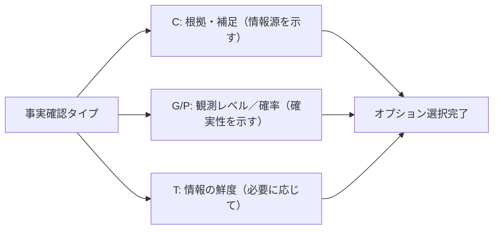

|優先度|オプション|理由|
|---|---|---|
|高|C（根拠・補足）|情報の出典や裏付けを示す|
|高|G/P（観測レベル／確率）|情報の確実性を明示する|
|中|T（情報の鮮度）|変化が速い分野では耐用期間を示す|
|中|L（歴史・経緯）|背景情報が必要な場合|

#### D-4-2. 説明・解説タイプ

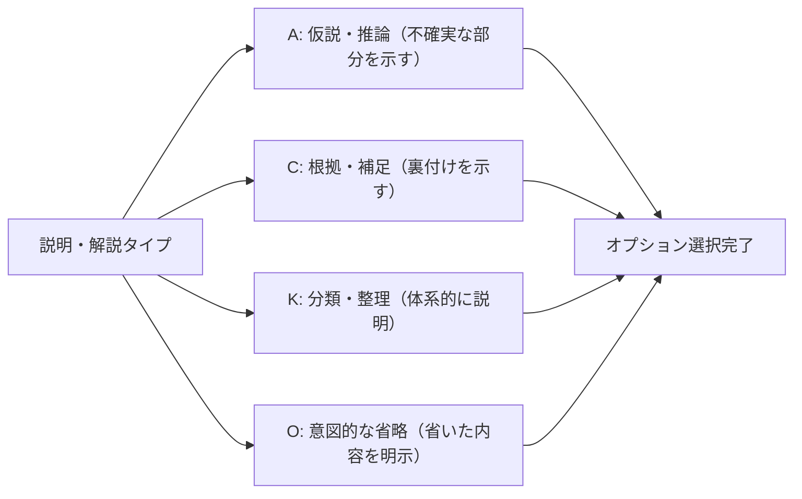

|優先度|オプション|理由|
|---|---|---|
|高|K（分類・整理）|複雑な概念を体系的に説明|
|高|C（根拠・補足）|説明の裏付けを示す|
|中|A（仮説・推論）|不確実な部分を明示する|
|中|O（意図的な省略）|初心者向けに省略した場合に明示|
|中|L（歴史・経緯）|概念の発展を説明する|
|中|M（定義の多義性）|用語の意味を整理する|

#### D-4-3. 比較・選択タイプ

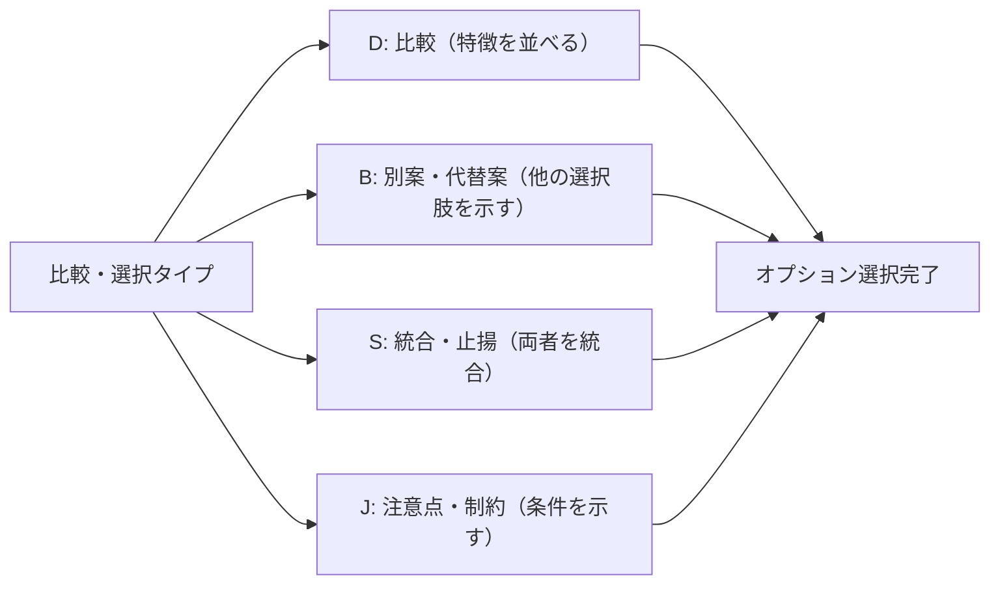

|優先度|オプション|理由|
|---|---|---|
|高|D（比較）|対象の特徴を並べて比較|
|高|B（別案・代替案）|他の選択肢も提示する|
|中|S（統合・止揚）|AとBを統合した新案を提示|
|中|J（注意点・制約）|選択の条件や制約を示す|

#### D-4-4. 意見・考察タイプ

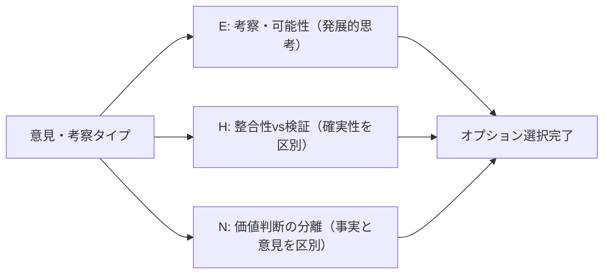

|優先度|オプション|理由|
|---|---|---|
|高|E（考察・可能性）|発展的な思考を展開|
|高|N（価値判断の分離）|事実と意見を区別する|
|中|H（整合性vs検証）|推測と実証を区別する|
|中|A（仮説・推論）|不確実な推測を明示する|

#### D-4-5. 方法・手順タイプ

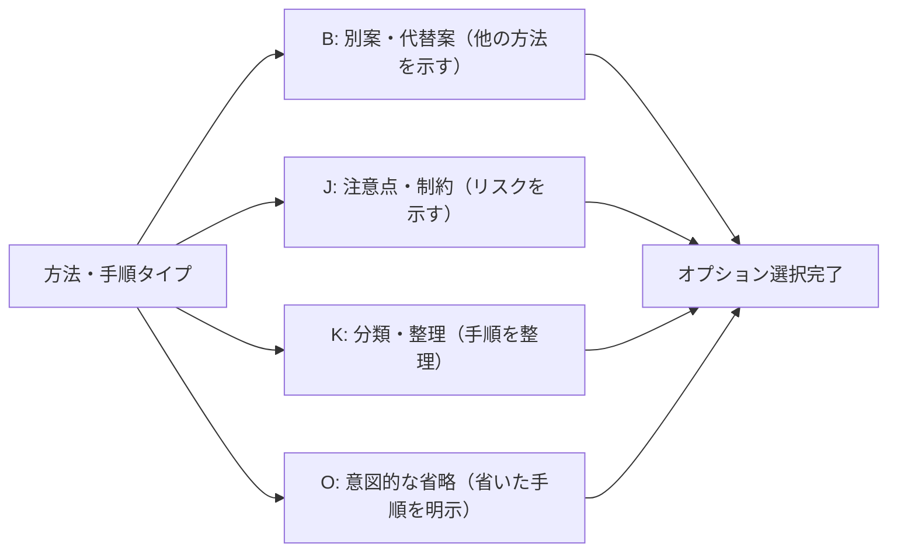

|優先度|オプション|理由|
|---|---|---|
|高|J（注意点・制約）|リスクや注意事項を示す|
|高|B（別案・代替案）|他の方法も提示する|
|中|K（分類・整理）|手順を体系的に整理する|
|中|O（意図的な省略）|上級者向け手順を省いた場合に明示|

#### D-4-6. 科学的検証タイプ

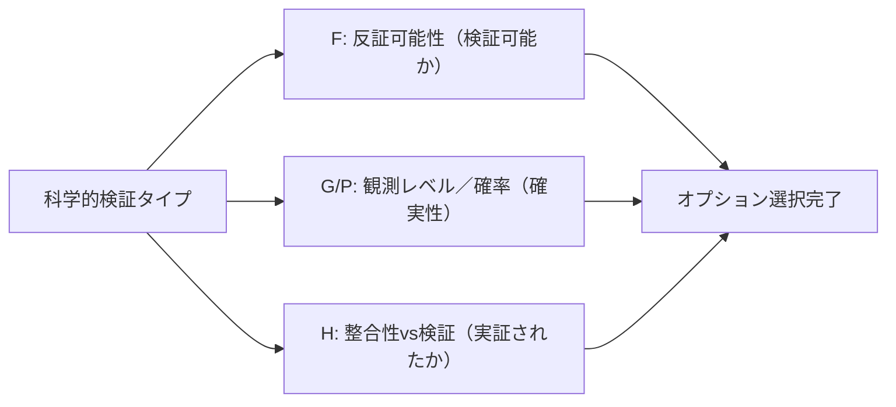

|優先度|オプション|理由|
|---|---|---|
|高|F（反証可能性）|科学的に検証可能か判定|
|高|G/P（観測レベル／確率）|どの程度確かめられたか|
|高|H（整合性vs検証）|説明可能と実証済みを区別|
|中|C（根拠・補足）|証拠や出典を示す|

#### D-4-7. 理論評価タイプ

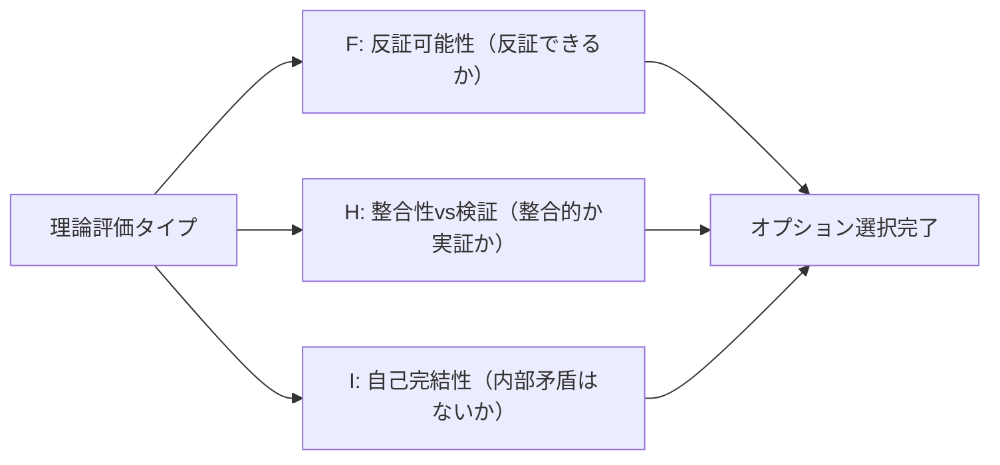

|優先度|オプション|理由|
|---|---|---|
|高|F（反証可能性）|理論が反証可能か判定|
|高|I（自己完結性）|内部矛盾がないか確認|
|高|H（整合性vs検証）|整合的なだけか実証済みか|
|中|L（歴史・経緯）|理論の発展過程を示す|

#### D-4-8. 倫理・政策タイプ

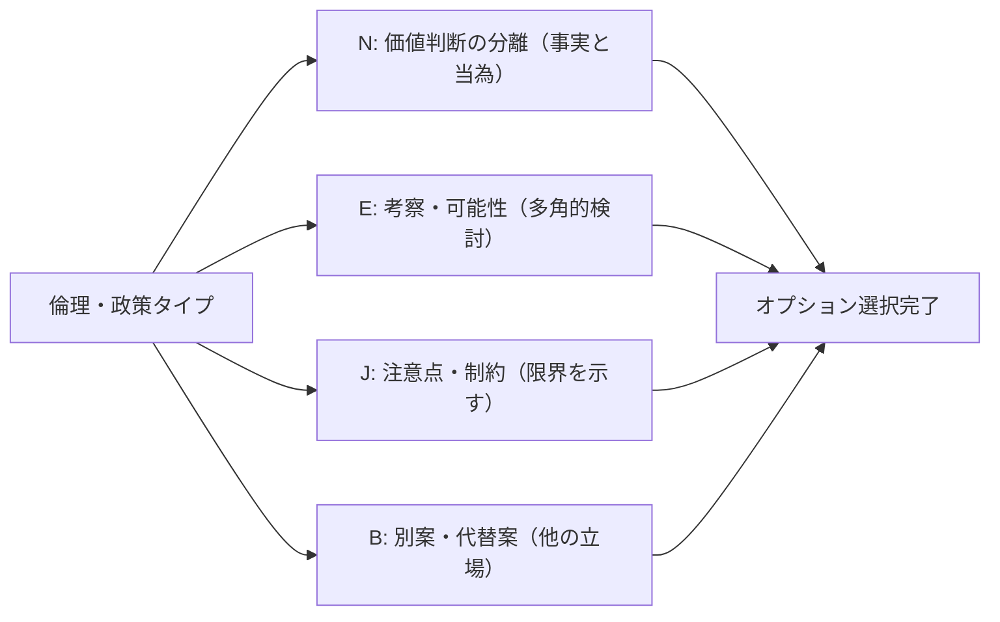

|優先度|オプション|理由|
|---|---|---|
|高|N（価値判断の分離）|事実と「〜すべき」を区別|
|高|E（考察・可能性）|多角的に検討する|
|中|B（別案・代替案）|他の立場や選択肢を示す|
|中|J（注意点・制約）|限界や条件を示す|
|中|M（定義の多義性）|価値観の違いを整理する|

#### D-4-9. 予測・リスク評価タイプ

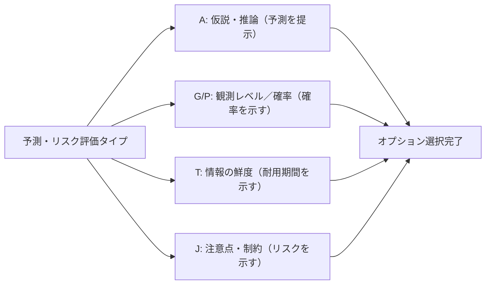

|優先度|オプション|理由|
|---|---|---|
|高|A（仮説・推論）|予測であることを明示|
|高|G/P（観測レベル／確率）|予測の確率を示す（Pモード推奨）|
|高|T（情報の鮮度）|予測の有効期間を示す|
|中|J（注意点・制約）|リスクや不確実性を示す|

#### D-4-10. 複合・その他タイプ

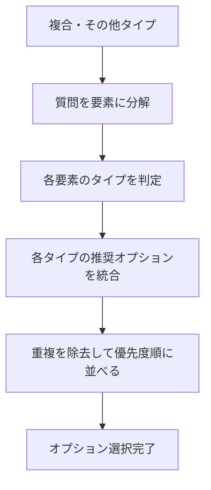

|ステップ|内容|例|
|---|---|---|
|1|質問を要素に分解|「〜の歴史と今後の展望は？」→「歴史」＋「展望」|
|2|各要素のタイプを判定|「歴史」→事実確認、「展望」→予測・リスク評価|
|3|推奨オプションを統合|事実確認のC,G/P,T ＋ 予測のA,G/P,T|
|4|重複除去・優先度順|A, C, G/P, T（重要度順に選択）|

### D-5. オプション選択早見表

質問タイプと推奨オプションの対応を一覧で示す。

| 質問タイプ    | 高優先       | 中優先        |
| -------- | --------- | ---------- |
| 事実確認     | C, G/P    | L, T       |
| 説明・解説    | C, K      | A, L, M, O |
| 比較・選択    | B, D      | J, S       |
| 意見・考察    | E, N      | A, H       |
| 方法・手順    | B, J      | K, O       |
| 科学的検証    | F, G/P, H | C          |
| 理論評価     | F, H, I   | L          |
| 倫理・政策    | E, N      | B, J, M    |
| 予測・リスク評価 | A, G/P, T | J          |

※各タイプの推奨理由は第4章（4-5）を参照してください。

### D-6. 判定に迷った場合

質問タイプの判定に迷った場合は、以下の手順で対処する。

|状況|対処法|
|---|---|
|複数タイプに該当しそう|複合・その他タイプとして扱い、各タイプのオプションを統合|
|どれにも該当しない|コア要素のみで回答し、必要に応じてオプションを追加|
|質問が曖昧|質問者に確認するか、想定される解釈を前提に明示して回答|

### D-7. リバーシブル仕様の選択フロー

F要素とG/P要素を使用する場合のモード選択フロー。

#### D-7-1. F要素のモード選択

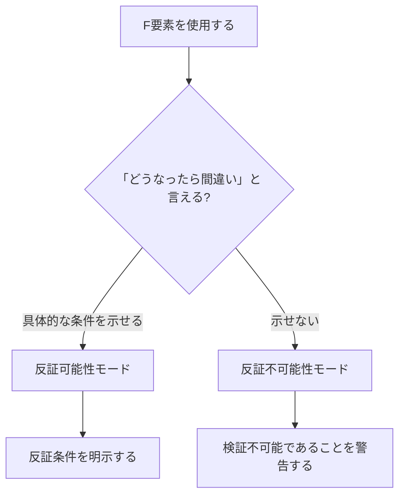

#### D-7-2. G/P要素のモード選択

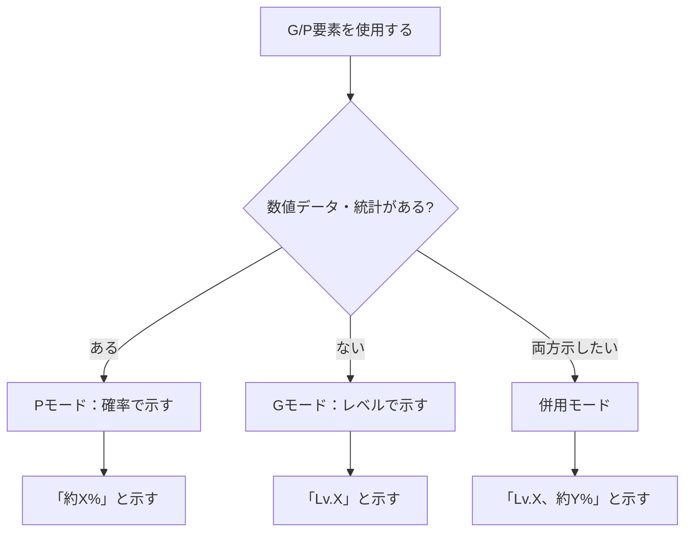

---
