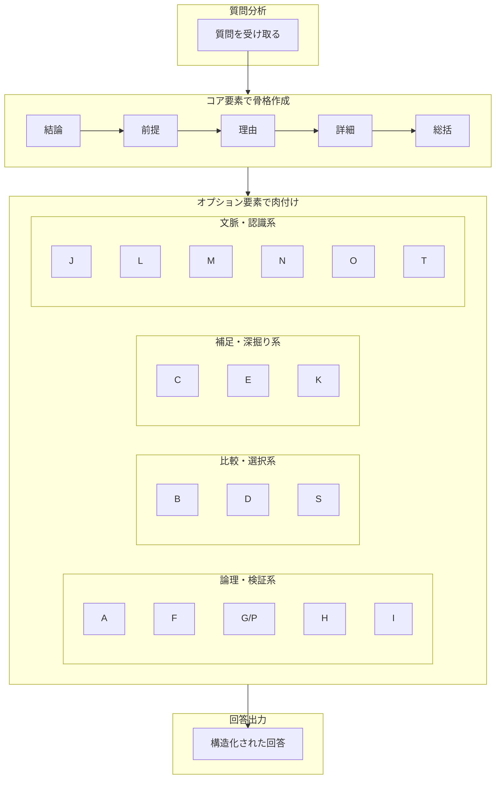

## 付録E オプション早見表

### E-1. 本付録の目的

本付録では、オプション要素A〜Tを1枚で確認できる早見表を提供する。回答作成時にすばやく参照できることを目的とする。

### E-2. オプション要素一覧表

|記号|名称|定義|使用場面|カテゴリ|リバーシブル|
|---|---|---|---|---|---|
|A|仮説・推論|まだ確定していない推測や可能性|不確実な情報、未来予測、未検証の理論|論理・検証系|―|
|B|別案・代替案|メインの結論以外の選択肢|方法論の提案、選択肢の比較、意思決定支援|比較・選択系|―|
|C|根拠・補足|主張を裏付けるデータ、出典、事例|事実確認、専門的説明、主張の裏付け|補足・深掘り系|―|
|D|比較|複数対象の特徴・相違点・類似点|AとBの比較、製品選択、概念の区別|比較・選択系|―|
|E|考察・可能性|事実を超えた発展的思考|哲学的問い、複雑な問題、将来予測|補足・深掘り系|―|
|F|反証可能性／反証不可能性|主張の検証可能性|科学的主張、理論の検討、批判的思考|論理・検証系|✅|
|G/P|観測・検証のレベル／確率・尤度|定性的確実性または定量的確率|科学的主張、信頼性判断、予測、リスク評価|論理・検証系|✅|
|H|整合性 vs 検証|説明可能と実証済みの区別|科学理論、歴史解釈、仮説評価|論理・検証系|―|
|I|自己完結性|内部矛盾なく成立しているか|理論の評価、論理構造の分析|論理・検証系|―|
|J|注意点・制約・適用範囲|リスク、限界、境界条件|実践的アドバイス、技術説明、安全指導|文脈・認識系|―|
|K|分類・整理|情報のカテゴリー分けと構造化|複数要素の説明、体系的理解、情報整理|補足・深掘り系|―|
|L|歴史・経緯|概念・問題の発展過程|語源、思想史、技術発展、制度変遷|文脈・認識系|―|
|M|定義の多義性|同じ言葉の複数の意味を整理|哲学用語、専門用語、議論のすれ違い防止|文脈・認識系|―|
|N|価値判断の分離|事実（is）と当為（ought）の区別|倫理、政策、意見が混じる議論|文脈・認識系|―|
|O|意図的な省略|あえて捨てた情報の明示|要約、初心者向け説明、文字数制限|文脈・認識系|―|
|S|統合・止揚|複数選択肢を統合して新案を創出|対立意見の折衷、イノベーション提案|比較・選択系|―|
|T|情報の鮮度・耐用期間|情報がいつまで有効かの明示|IT技術、法律、医療、時事問題|文脈・認識系|―|

※リバーシブル仕様の要素は「リバーシブル」列に✅で示している。正式名称（括弧付き表記）は第4章の各要素見出しを参照。

### E-3. カテゴリ別早見表

#### 論理・検証系（5要素）

|記号|名称|一言説明|使うタイミング|リバーシブル|
|---|---|---|---|---|
|A|仮説・推論|「たぶん〜」|確実でない時|―|
|F|反証可能性／反証不可能性|「反証できる？」|科学的に検証したい時|✅|
|G/P|観測レベル／確率|「どれくらい確か？」|確実性を示したい時|✅|
|H|整合性vs検証|「説明できる？実証された？」|理論を評価する時|―|
|I|自己完結性|「矛盾してない？」|論理構造をチェックする時|―|

#### 比較・選択系（3要素）

|記号|名称|一言説明|使うタイミング|
|---|---|---|---|
|B|別案・代替案|「他の方法は？」|選択肢を広げたい時|
|D|比較|「どう違う？」|複数を比べる時|
|S|統合・止揚|「いいとこ取りできない？」|対立を解消したい時|

#### 補足・深掘り系（3要素）

|記号|名称|一言説明|使うタイミング|
|---|---|---|---|
|C|根拠・補足|「証拠は？」|裏付けが必要な時|
|E|考察・可能性|「さらに考えると？」|思考を広げたい時|
|K|分類・整理|「整理すると？」|情報が多い時|

#### 文脈・認識系（6要素）

|記号|名称|一言説明|使うタイミング|
|---|---|---|---|
|J|注意点・制約|「気をつけることは？」|リスクを伝える時|
|L|歴史・経緯|「どうしてこうなった？」|背景を説明する時|
|M|定義の多義性|「どの意味で使ってる？」|言葉の意味がズレそうな時|
|N|価値判断の分離|「事実？意見？」|事実と意見を区別する時|
|O|意図的な省略|「何を省いた？」|簡潔にしたい時|
|T|情報の鮮度|「いつまで有効？」|変化が速い分野の時|

### E-4. 質問タイプ別推奨オプション早見表

|質問タイプ|高優先|中優先|
|---|---|---|
|事実確認|C, G/P|L, T|
|説明・解説|C, K|A, L, M, O|
|比較・選択|B, D|J, S|
|意見・考察|E, N|A, H|
|方法・手順|B, J|K, O|
|科学的検証|F, G/P, H|C|
|理論評価|F, H, I|L|
|倫理・政策|E, N|B, J, M|
|予測・リスク評価|A, G/P, T|J|

※本表は付録D（D-5）と同一内容を再掲したものです。各タイプの推奨理由は第4章（4-5）を参照してください。

### E-5. オプション選択クイックガイド

迷ったら、以下の質問に答えて選ぶ。

|質問|Yesなら使うオプション|
|---|---|
|確実じゃない推測がある？|A（仮説・推論）|
|他の選択肢もある？|B（別案・代替案）|
|裏付けデータがある？|C（根拠・補足）|
|複数のものを比べる？|D（比較）|
|もっと深く考えたい？|E（考察・可能性）|
|科学的に検証できる？|F（反証可能性）|
|どれくらい確かな情報？|G/P（観測レベル／確率）|
|説明できるだけ？実証済み？|H（整合性vs検証）|
|理論に矛盾はない？|I（自己完結性）|
|注意すべきことがある？|J（注意点・制約）|
|情報を整理したい？|K（分類・整理）|
|歴史や背景を説明したい？|L（歴史・経緯）|
|言葉の意味がズレそう？|M（定義の多義性）|
|事実と意見が混じってる？|N（価値判断の分離）|
|何かを省略した？|O（意図的な省略）|
|対立する案を統合したい？|S（統合・止揚）|
|情報の有効期限を示したい？|T（情報の鮮度）|

### E-6. リバーシブル仕様クイックガイド

#### F要素：反証可能性／反証不可能性

|質問|答え|使うモード|
|---|---|---|
|「どうなったら間違いと分かる？」|具体的な条件を示せる|反証可能性モード|
|「どうなったら間違いと分かる？」|示せない|反証不可能性モード|

#### G/P要素：観測レベル／確率

|質問|答え|使うモード|
|---|---|---|
|数値データ・統計がある？|ある|Pモード（確率で示す）|
|数値データ・統計がある？|ない|Gモード（レベルで示す）|
|数値データ・統計がある？|両方示したい|併用モード|

### E-7. G/Pモード対応早見表

|Gモード（定性的）|Pモード（定量的）|表現例|
|---|---|---|
|Lv.4（直接観測）|95%以上|「ほぼ確実」|
|Lv.3（間接観測）|70-95%|「可能性が高い」|
|Lv.2（理論的整合性）|40-70%|「五分五分〜やや優勢」|
|Lv.1（単なる推論）|40%未満|「可能性は低い」|

※これはあくまで目安であり、状況に応じて異なる場合がある。

### E-8. 新規追加要素（Ver. 2.0）早見表

|記号|名称|一言説明|カテゴリ|
|---|---|---|---|
|O|Omission（意図的な省略）|「あえて省いた」を明示|文脈・認識系|
|S|Synthesis（統合・止揚）|「いいとこ取り」で新案創出|比較・選択系|
|T|Time-sensitivity（情報の鮮度）|「いつまで有効か」を明示|文脈・認識系|

### E-9. オプション要素の関係図

---
