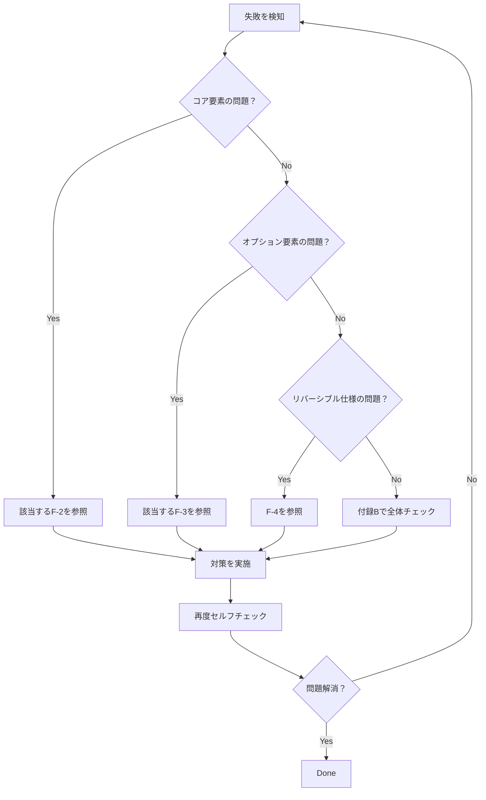

## 付録F よくある失敗パターン

## F-1. 本付録の目的

本付録は、CASLS使用時に陥りやすい失敗パターンを整理し、その原因と対策を示すことで、回答品質の向上を支援する。

---

## F-2. コア要素に関する失敗パターン

### F-2-1. 結論（端的に）の失敗

|失敗パターン|症状|原因|対策|
|---|---|---|---|
|結論の後回し|前置きが長く、結論が中盤以降に出る|説明から入る癖|最初の1〜2文で結論を述べる|
|曖昧な結論|「場合による」「一概には言えない」で終わる|判断を避けている|条件を明示した上で結論を述べる|
|質問と結論のズレ|聞かれていないことに答えている|質問の読み違い|Step1に戻り質問を再分析|
|複数結論の混在|結論が2つ以上あり、どれが主かわからない|整理不足|最も重要な結論を1つに絞る|

### F-2-2. 前提の失敗

|失敗パターン|症状|原因|対策|
|---|---|---|---|
|前提の省略|暗黙の前提が多く、読み手が混乱|自明だと思い込む|重要な前提は必ず明示|
|前提過多|前提が長すぎて本題に入れない|網羅しようとしすぎ|必要最小限に絞る|
|前提の押しつけ|相手が同意していない前提で議論を進める|相手の視点の欠如|前提の共有を確認する|
|時点の不明確|いつの情報かわからない|T要素の意識不足|情報の時点を明示する|

### F-2-3. 理由・論理の失敗

|失敗パターン|症状|原因|対策|
|---|---|---|---|
|論理の飛躍|AからいきなりCに飛ぶ|中間ステップの省略|A→B→Cの流れを明示|
|循環論法|結論を理由にしている|独立根拠の不足|結論とは別の根拠を用意|
|感情と論理の混同|「〜べき」「〜はおかしい」が根拠|価値判断と事実の混同|N要素で分離する|
|根拠の羅列|理由が並んでいるが繋がりがない|構造化の不足|因果関係を明示する|

### F-2-4. 結論（詳細版）の失敗

|失敗パターン|症状|原因|対策|
|---|---|---|---|
|端的な結論との矛盾|最初と後で言っていることが違う|論理展開中に結論が変わった|最初の結論に戻って整合性確認|
|具体性の欠如|「やればいい」「考えればいい」で終わる|実践レベルまで落とし込めていない|具体的な行動・数値を示す|
|情報過多|詳細すぎて何が重要かわからない|絞り込み不足|O要素で意図的に省略する|

### F-2-5. 総括の失敗

|失敗パターン|症状|原因|対策|
|---|---|---|---|
|新情報の追加|総括で初出の情報が出る|総括の役割の誤解|総括は既出内容のまとめに限定|
|単なる繰り返し|結論をそのまま言い直すだけ|付加価値がない|示唆・次のステップを加える|
|尻切れトンボ|締めくくり感がない|構成意識の不足|「以上より〜」等の締め表現を使う|

---

## F-3. オプション要素に関する失敗パターン

### F-3-1. 選択の失敗

|失敗パターン|症状|原因|対策|
|---|---|---|---|
|オプション過剰|回答が冗長で読み切れない|全部入れようとする|質問タイプ別の推奨を参照|
|オプション不足|重要な観点が抜けている|必要性の判断ミス|付録Dのフローで再確認|
|不適切な選択|事実確認にN（価値判断）を使う等|カテゴリの理解不足|E-2の一覧表を参照|

### F-3-2. 論理・検証系の失敗

| 要素       | 失敗パターン     | 対策                          |
| -------- | ---------- | --------------------------- |
| A（仮説・推論） | 仮説を断定調で述べる | 「〜と考えられる」「〜の可能性がある」を使う      |
| F（反証可能性） | モードの選択ミス   | 科学的主張→反証可能性モード、信念→反証不可能性モード |
| G/P      | 根拠なく確率を述べる | 数値根拠がなければGモードを使う            |
| H        | 整合性と検証を混同  | 「説明できる≠正しい」を意識              |
| I        | 自己完結性を過大評価 | 外部情報との接点も確認                 |

### F-3-3. 比較・選択系の失敗

|要素|失敗パターン|対策|
|---|---|---|
|B（別案）|非現実的な代替案を出す|実現可能性を考慮|
|D（比較）|比較軸が不公平|MECEを意識し、同じ軸で比較|
|S（統合）|折衷案が中途半端|両者の本質的な良さを抽出|

### F-3-4. 補足・深掘り系の失敗

|要素|失敗パターン|対策|
|---|---|---|
|C（根拠・補足）|信頼性の低い情報を引用|一次情報・査読論文を優先|
|E（考察）|考察が妄想になる|G/Pでレベルを明示|
|K（分類）|分類がMECEでない|漏れ・重複をチェック|

### F-3-5. 文脈・認識系の失敗

|要素|失敗パターン|対策|
|---|---|---|
|J（注意点）|注意点が多すぎて本題が埋もれる|重要度でフィルタリング|
|L（歴史・経緯）|歴史が長すぎる|現在の議論に必要な範囲に限定|
|M（定義の多義性）|定義を1つに決めつける|複数の定義を併記|
|N（価値判断）|事実と価値を混同|is と ought を分離|
|O（意図的省略）|省略を明示しない|「〜は本稿では省略」と明記|
|T（情報の鮮度）|古い情報を最新として扱う|時点と有効期限を明示|

---

## F-4. リバーシブル仕様の失敗パターン

### F-4-1. F要素の失敗

| 失敗パターン   | 症状                 | 対策          |
| -------- | ------------------ | ----------- |
| モード選択ミス  | 科学的主張に反証不可能性モードを使う | 検証可能性で判断    |
| 反証条件の不明確 | 「反証可能」と言うが条件がない    | 具体的な反証条件を示す |
| 過度の相対主義  | 何でも「反証不可能」にする      | 検証可能な部分を探す  |

### F-4-2. G/P要素の失敗

|失敗パターン|症状|対策|
|---|---|---|
|偽の精度|根拠なく「87.3%」等と述べる|根拠がなければGモード|
|レベル誤認|Lv.2をLv.4と主張|観測の直接性で判断|
|併用の矛盾|GとPが矛盾している|両者の整合性を確認|

---

## F-5. 失敗パターン・クイックチェック

回答作成後、以下を確認する：

```
□ 結論が最初の1〜2文にあるか？
□ 前提は明示されているか？
□ 論理に飛躍はないか？
□ オプションは適切に選択されているか？
□ リバーシブル仕様のモードは正しいか？
□ 情報の鮮度（T）は明示されているか？
□ 意図的な省略（O）は明記されているか？
```

---

## F-6. 失敗からの回復フロー



---

## F-7. 本付録のまとめ

失敗パターンを事前に知っておくことで、同じ失敗を繰り返さない。重要なのは、失敗を恐れることではなく、失敗から学ぶことである。CASLS は完璧を目指すツールではなく、品質を安定させるためのフレームワークであることを忘れずに。

---
