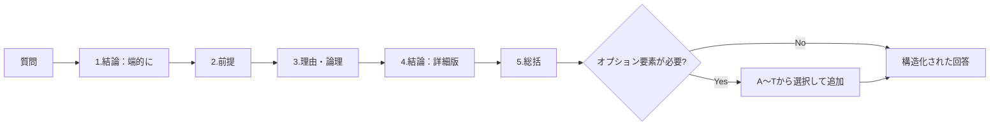

## 第1章 概要

### 1-1. 本システムの目的

CASLSは、あらゆる質問に対して論理的で厳密な回答を提供するための包括的フレームワークである。

回答の品質を安定させ、論理の飛躍や情報の欠落を防ぎ、読み手が納得できる構造化された回答を生成することを目的とする。

本システムは、**コア要素**で回答の基本構造を保ちつつ、**オプション要素**で質問の性質に応じた深掘りを可能にする二層構造を採用している。これにより、シンプルな質問から高度な学術的議論まで、一貫した品質で対応できる。

### 1-2. 基本理念

CASLSは以下の4つの理念に基づいて設計されている。

|理念|説明|
|---|---|
|構造化|回答を明確な要素に分解し、再現可能な形にする。誰が使っても同じ構造で回答を組み立てられる|
|柔軟性|必須要素で基盤を保ちつつ、任意要素で深掘りを可能にする。質問の複雑さに応じて拡張できる|
|厳密性|科学哲学的な検証観点（反証可能性、観測レベル等）を組み込み、曖昧さを排除する|
|汎用性|日常の質問から学術的議論まで、あらゆる質問タイプに対応する|

### 1-3. 名称の由来

CASLSという名称は、本システムの構造を表す5つの単語の頭文字から構成されている。

|要素|単語|意味|
|---|---|---|
|C|Core|核心。必ず含む基本構造を指す|
|A|Answer|回答。本システムが生成する対象|
|S|Segment|区分。回答を明確な要素に分割する設計思想|
|L|Layer|層。コア層とオプション層の階層構造|
|S|System|体系。統合されたフレームワーク全体|

**読み方：カシルス**

### 1-4. 全体構造図

CASLSの処理フローを以下に示す。

### 1-5. 本資料の構成

本資料は以下の章と付録で構成される。

| 章   | タイトル           | 内容                               |
| --- | -------------- | -------------------------------- |
| 第1章 | 概要             | 本システムの目的、理念、名称の由来、全体構造（本章）       |
| 第2章 | 基本構造           | コア要素とオプション要素の関係性                 |
| 第3章 | コア要素           | 全質問に適用する5つの必須要素の詳細               |
| 第4章 | オプション要素        | 質問の性質に応じて選択する17の要素（A〜O, S, T）の詳細 |
| 第5章 | 注意事項           | フレームワーク使用時の留意点                   |
| 付録A | 使い方ガイド（詳細版）    | 基本手順、質問タイプ別推奨、シンプル版との使い分け        |
| 付録B | セルフチェックシート     | 回答作成後の確認項目リスト                    |
| 付録C | 用語集            | フレームワーク内で使用する用語の定義               |
| 付録D | 質問タイプ判定フローチャート | どのオプションを選ぶか判断する流れ図               |
| 付録E | オプション早見表       | A〜Tの一覧と使用場面を1枚で確認                |
| 付録F | よくある失敗パターン     | フレームワーク誤用例と対策                    |
| 付録G | FAQ            | よくある質問と回答                        |

### 1-6. Ver. 2.0 での変更点

Ver. 1.0 から Ver. 2.0 への主な変更点を以下に示す。

| 項目       | Ver. 1.0         | Ver. 2.0                        |
| -------- | ---------------- | ------------------------------- |
| オプション要素数 | 14個（A〜N）         | 17個（A〜O, S, T）※GはG/Pリバーシブル仕様で運用 |
| リバーシブル仕様 | F のみ             | F, G/P の2つ                      |
| G要素      | 観測・検証のレベル        | 観測・検証のレベル／確率・尤度（リバーシブル仕様）       |
| 質問タイプ    | 8種＋複合・その他（計9タイプ） | 9種＋複合・その他（計10タイプ）               |

**追加されたオプション要素：**

|記号|名称|カテゴリ|
|---|---|---|
|O|Omission（意図的な省略）|文脈・認識系|
|S|Synthesis（統合・止揚）|比較・選択系|
|T|Time-sensitivity（情報の鮮度・耐用期間）|文脈・認識系|

**リバーシブル仕様の拡張：**

|要素|リバーシブルの内容|
|---|---|
|F|反証可能性 ⇄ 反証不可能性|
|G/P|定性的確実性（G） ⇄ 定量的確率（P）|

**その他の変更：**

|項目|内容|
|---|---|
|付録C|用語集の大幅拡充（早見表の追加等）|
|付録A|リバーシブル仕様ガイド（A-6）の追加|

---
