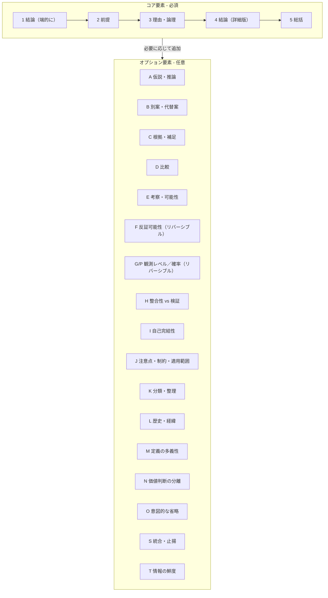
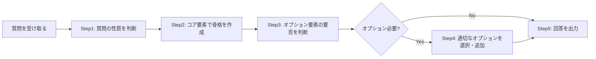
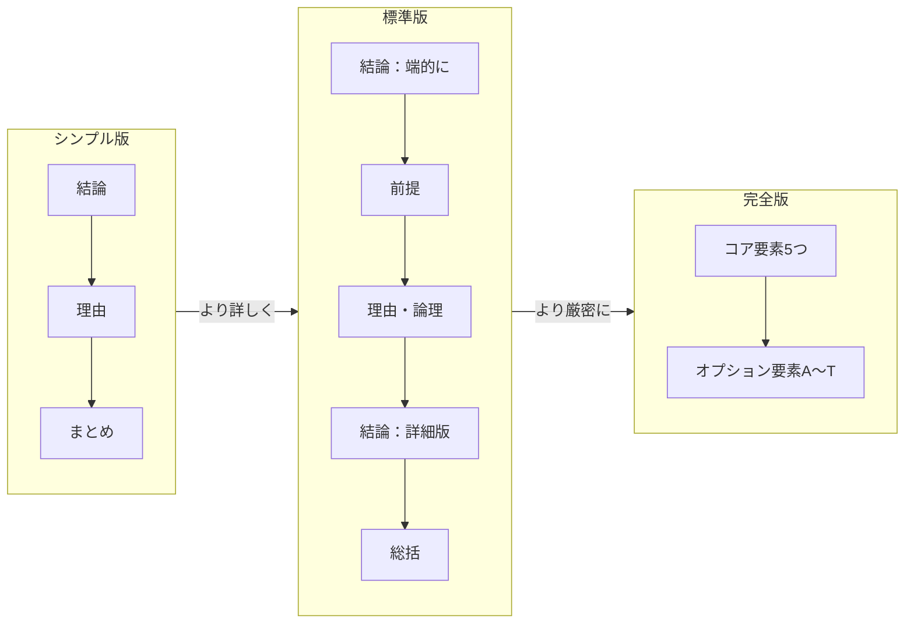

## 第2章 基本構造

### 2-1. 二層構造の設計思想

CASLSは「コア要素」と「オプション要素」の二層構造を採用している。

この設計により、すべての回答に一貫した基盤を持たせつつ、質問の性質に応じた柔軟な拡張を可能にしている。

| 層   | 名称      | 性質          | 要素数                              |
| --- | ------- | ----------- | -------------------------------- |
| 第1層 | コア要素    | 必須。全質問に適用   | 5要素                              |
| 第2層 | オプション要素 | 任意。質問に応じて選択 | 17要素（A〜O, S, T）※GはG/Pリバーシブル仕様で運用 |

### 2-2. コア要素とオプション要素の関係

コア要素は回答の「骨格」であり、オプション要素は「肉付け」である。

コア要素だけでも回答として成立するが、オプション要素を追加することで、より深く、より厳密な回答になる。

### 2-3. 処理フロー

CASLSを用いた回答生成は、以下のフローで行う。

|ステップ|内容|詳細|
|---|---|---|
|Step1|質問の性質を判断|事実確認か、比較か、意見か、方法論か等を見極める|
|Step2|コア要素で骨格を作成|結論→前提→理由→詳細→総括の順で構築|
|Step3|オプション要素の要否を判断|質問の複雑さ、求められる厳密性を評価|
|Step4|適切なオプションを選択・追加|A〜Tから必要なものだけを選ぶ|
|Step5|回答を出力|構造化された回答として提示|

### 2-4. 二層構造の利点

この設計には以下の利点がある。

|利点|説明|
|---|---|
|安定性|コア要素により、どんな質問でも最低限の構造が保証される|
|拡張性|オプション要素により、必要なだけ深掘りできる|
|効率性|簡単な質問にはコア要素のみで素早く対応できる|
|厳密性|科学的・哲学的な質問にはオプション要素F〜Tで厳密に対応できる|
|学習容易性|まずコア要素を覚え、徐々にオプションを習得する段階的学習が可能|

### 2-5. シンプル版との関係

日常的な質問には、コア要素をさらに簡略化した「シンプル版」も使用できる。

| 版     | 構成           | コア要素との対応                       | 用途             |
| ----- | ------------ | ------------------------------ | -------------- |
| シンプル版 | 結論→理由→まとめ    | 結論＝Core-1、理由＝Core-3、まとめ＝Core-5 | 日常的な質問、時間がない場合 |
| 標準版   | コア要素5つ       | Core-1〜5を全て使用                  | 通常の質問          |
| 完全版   | コア要素＋オプション要素 | Core-1〜5＋A〜Tから選択               | 厳密な検証が必要な質問    |

### 2-6. オプション要素のカテゴリ構成

Ver. 2.0 におけるオプション要素のカテゴリ構成を以下に示す。

| カテゴリ    | 要素               | 用途          |
| ------- | ---------------- | ----------- |
| 論理・検証系  | A, F, G/P, H, I  | 主張の妥当性を検証する |
| 比較・選択系  | B, D, S          | 複数の選択肢を扱う   |
| 補足・深掘り系 | C, E, K          | 情報を追加・整理する  |
| 文脈・認識系  | J, L, M, N, O, T | 前提や文脈を明確にする |

※各カテゴリの詳細な構成図は第4章（4-1）を参照。

### 2-7. リバーシブル仕様について

Ver. 2.0 では、2つの要素がリバーシブル仕様を採用している。

|要素|モード1|モード2|切り替え基準|
|---|---|---|---|
|F|反証可能性|反証不可能性|主張が科学的に検証可能か否か|
|G/P|Gモード（定性的確実性）|Pモード（定量的確率）|数値根拠の有無|

リバーシブル仕様の詳細は第4章で解説する。

---
