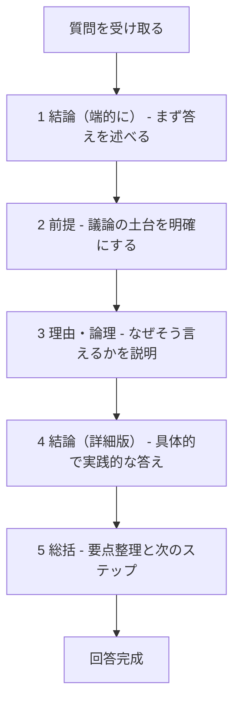
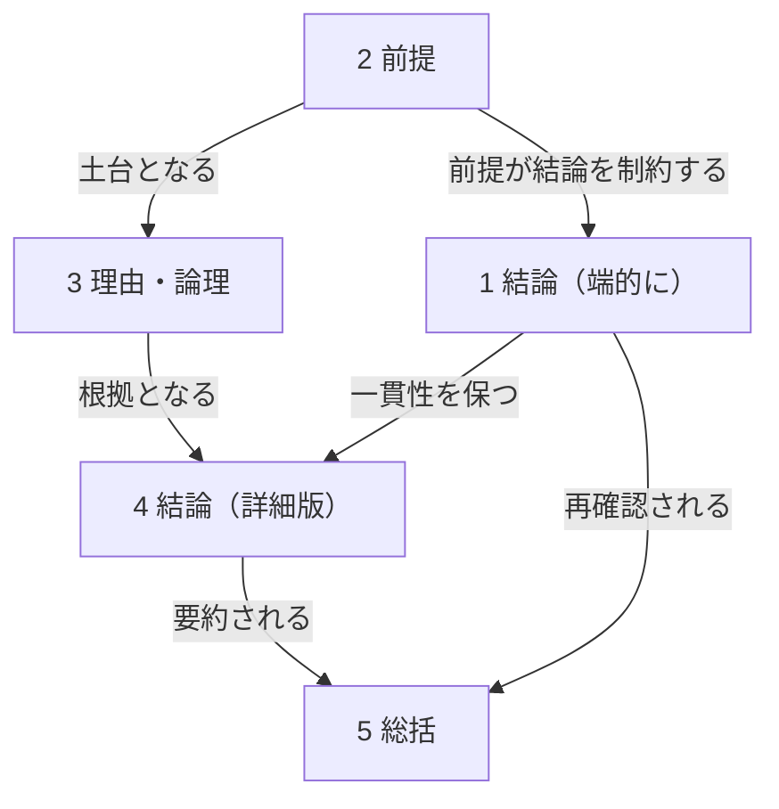

## 第3章 コア要素

### 3-1. コア要素の概要

コア要素は、CASLSにおける回答の「骨格」である。すべての質問に対して、この5つの要素を適用することで、論理的で一貫性のある回答を構築できる。

|No.|要素名|役割|キーワード|
|---|---|---|---|
|1|結論（端的に）|質問への直接的な答え|まず答える|
|2|前提|議論の土台を明確にする|条件を揃える|
|3|理由・論理|なぜその結論かを説明|納得させる|
|4|結論（詳細版）|具体的で実践的な答え|使えるようにする|
|5|総括|全体を俯瞰して締める|持ち帰りを明確に|

### 3-2. 各要素の詳細

#### 3-2-1. 結論（端的に）

質問への直接的な答えを、最初に端的に述べる。

|項目|内容|
|---|---|
|定義|質問への直接的な答え。YES/NO、または核心を1〜2文で提示|
|目的|読み手が即座に答えを把握できるようにする。時間がない人はここだけ読めばOK|
|位置|回答の最初|

**良い例：**

- 「はい、可能です」
- 「結論から言うと、Aの方が優れています」
- 「答えは3つあります」

**悪い例：**

- 「それについては様々な観点がありまして〜」（結論が後回し）
- 「難しい問題ですね〜」（結論になっていない）

#### 3-2-2. 前提

議論の土台となる状況、条件、定義、文脈を明確にする。

|項目|内容|
|---|---|
|定義|議論の土台となる状況、条件、定義、文脈の明示|
|目的|誤解を防ぎ、議論の範囲を明確にする。「何について話しているのか」の共通理解を作る|
|位置|結論（端的に）の直後|

**良い例：**

- 「この質問は〜という状況を前提としています」
- 「ここでは『成功』を〇〇と定義します」
- 「2026年1月時点の情報に基づいています」

**悪い例：**

- 前提を述べずにいきなり説明を始める
- 暗黙の前提に依存する

**前提に含めるべき内容：**

|種類|例|
|---|---|
|状況・文脈|「日本国内の場合」「ビジネス用途において」|
|定義|「ここでいう『効率』とは時間あたりの産出量を指す」|
|制約条件|「予算100万円以内で」「初心者向けに」|
|時点|「2026年1月時点の法律では」|
|立場・視点|「経営者の視点から見ると」|
|スケール|「個人レベルでは」「社会全体では」|

#### 3-2-3. 理由・論理

なぜその結論に至るのかの思考プロセスを示す。

|項目|内容|
|---|---|
|定義|なぜその結論に至るのかの思考プロセス。因果関係や論理的つながり|
|目的|結論の妥当性を示す。読み手が納得できる道筋を提供する|
|位置|前提の直後|

**良い例：**

- 「なぜなら〜だからです」
- 「これは〜という原理に基づいています」
- 「理由は3つあります。第一に〜、第二に〜、第三に〜」

**悪い例：**

- 「とにかくそうなんです」（理由がない）
- 「みんなそう言っています」（論理ではなく権威への訴え）

**論理展開のパターン：**

|パターン|説明|例|
|---|---|---|
|因果関係|AだからB|「需要が増えたため、価格が上昇した」|
|演繹|一般法則→具体例|「哺乳類は肺呼吸する。犬は哺乳類。よって犬は肺呼吸する」|
|帰納|具体例→一般化|「A社もB社もC社も成功した。よってこの手法は有効である」|
|類推|似た事例からの推論|「過去の類似事例では〜だったので、今回も〜だろう」|
|消去法|他の選択肢を排除|「AでもBでもない。よってCである」|

#### 3-2-4. 結論（詳細版）

前提と理由を踏まえた上での、より具体的で詳しい答えを提示する。

|項目|内容|
|---|---|
|定義|前提と理由を踏まえた上での、より具体的で詳しい答え|
|目的|端的な結論だけでは不足する情報を補完。実践に使える形で提示|
|位置|理由・論理の直後|

**結論（端的に）との違い：**

|要素|結論（端的に）|結論（詳細版）|
|---|---|---|
|目的|即座に答えを把握|実践に使える詳細を提供|
|長さ|1〜2文|必要な分だけ|
|内容|YES/NOや核心のみ|具体例、手順、条件分岐など|
|読者|時間がない人|詳しく知りたい人|

**良い例：**

- 「具体的には、以下の3ステップで実行します」
- 「実際の運用では、〜に注意しながら〜します」
- 「ケースAの場合は〜、ケースBの場合は〜」

#### 3-2-5. 総括

全体を俯瞰した要点整理、示唆、または次のステップを示す。

|項目|内容|
|---|---|
|定義|全体を俯瞰した要点整理、示唆、または次のステップ|
|目的|議論を締めくくり、読み手が何を持ち帰るべきかを明確にする|
|位置|回答の最後|

**良い例：**

- 「まとめると〜」
- 「重要なポイントは〜」
- 「次のステップとして〜をお勧めします」

**総括に含められる内容：**

|種類|説明|
|---|---|
|要点整理|議論の核心を簡潔にまとめる|
|示唆|議論から得られる教訓や含意|
|次のステップ|読み手が次に取るべき行動|
|残された課題|今回答えられなかったこと、今後の検討事項|

### 3-3. コア要素のフロー図

コア要素は以下の順序で構築する。

### 3-4. コア要素の適用例

以下に、コア要素を適用した回答の例を示す。

**質問：「プログラミング初心者はPythonから始めるべきですか？」**

|要素|内容|
|---|---|
|1. 結論（端的に）|はい、Pythonから始めることをお勧めします|
|2. 前提|ここでは「初心者」を、プログラミング経験がゼロの人と定義します。また、目的を「プログラミングの基礎を学ぶこと」とします|
|3. 理由・論理|理由は3つあります。第一に、文法がシンプルで読みやすい。第二に、学習リソースが豊富。第三に、実用的な分野（Web、データ分析、AI等）に幅広く使える|
|4. 結論（詳細版）|具体的には、まずPythonの基本文法を2〜4週間で学び、その後、興味のある分野（Webならフレームワーク、データ分析ならpandas等）に進むルートがお勧めです|
|5. 総括|まとめると、Pythonは「学びやすさ」と「実用性」のバランスが良いため、初心者の最初の言語として最適です。まずは公式チュートリアルから始めてみてください|

### 3-5. コア要素の相互関係

各コア要素は独立しているのではなく、相互に関連している。

|関係|説明|
|---|---|
|前提 → 結論（端的に）|前提が結論を制約する。前提が変われば結論も変わりうる|
|前提 → 理由・論理|前提が理由・論理の土台となる。前提なしに論理は成立しない|
|理由・論理 → 結論（詳細版）|理由・論理が詳細な結論の根拠となる|
|結論（端的に）⇄ 結論（詳細版）|両者は一貫している必要がある。矛盾してはならない|
|結論（詳細版）→ 総括|詳細版の要点が総括で整理される|
|結論（端的に）⇄ 総括|総括で結論が再確認される|

---
