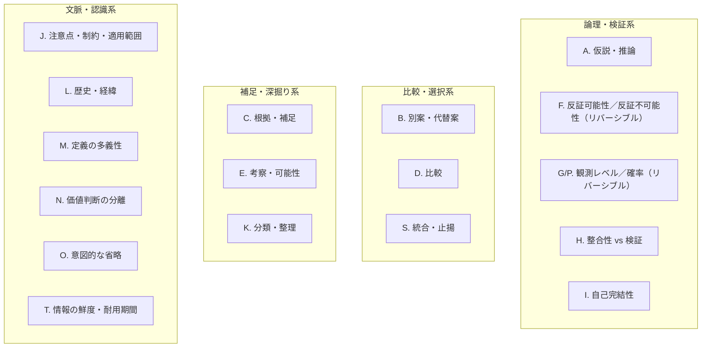
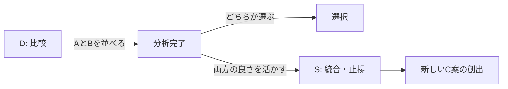
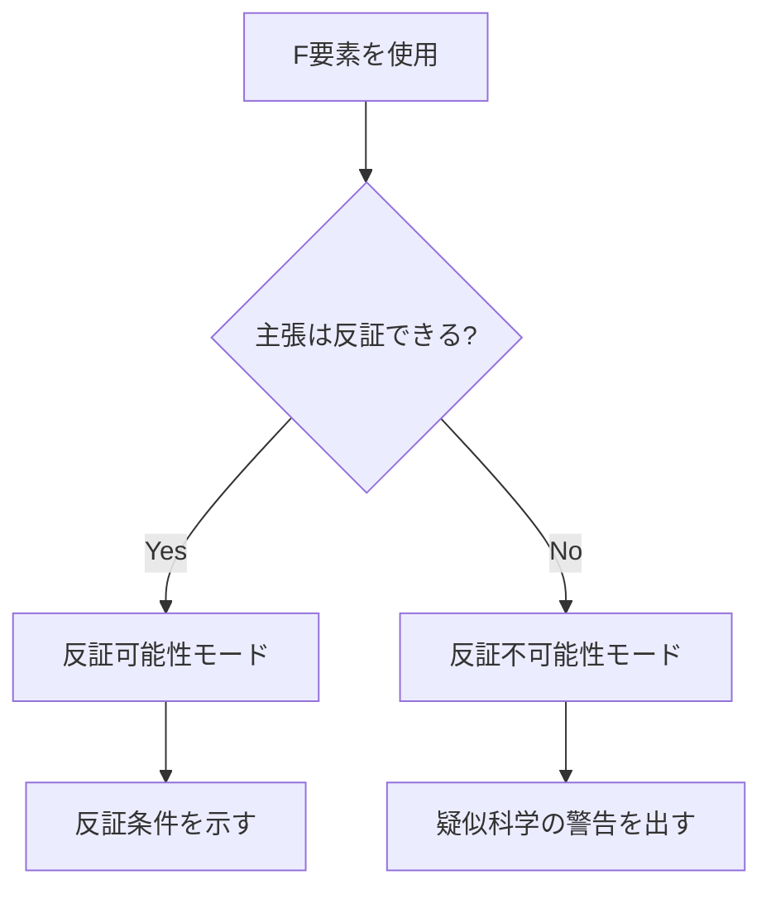
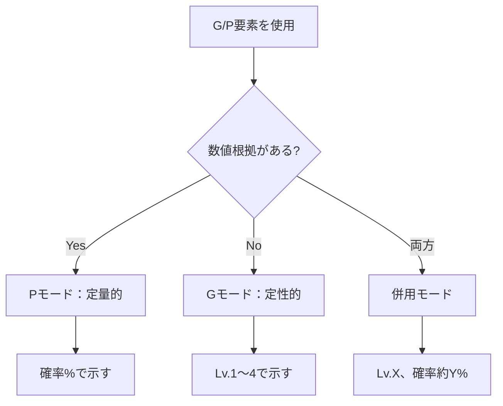
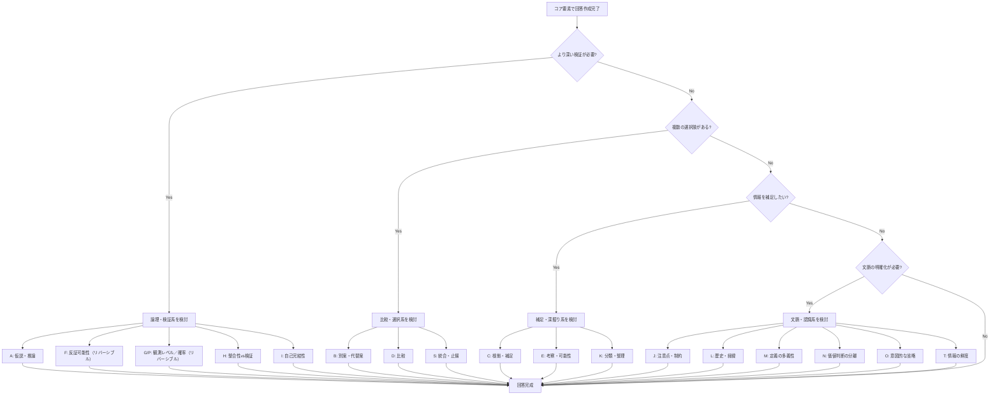

## 第4章 オプション要素

### 4-1. オプション要素の概要

オプション要素は、コア要素だけでは不足する場合に追加する「深掘り」のための要素である。質問の性質に応じて、必要なものだけを選択して使用する。

全17要素をカテゴリ別に整理すると以下のようになる。

|カテゴリ|要素|用途|
|---|---|---|
|論理・検証系|A, F, G/P, H, I|主張の妥当性を検証する|
|比較・選択系|B, D, S|複数の選択肢を扱う|
|補足・深掘り系|C, E, K|情報を追加・整理する|
|文脈・認識系|J, L, M, N, O, T|前提や文脈を明確にする|

### 4-2. 各要素の詳細（A〜N）

---

#### 4-2-1. A. 仮説・推論

まだ確定していない推測や可能性を提示する。

|項目|内容|
|---|---|
|定義|まだ確定していない推測や可能性。「おそらく〜」「〜と考えられる」レベルの内容|
|目的|確実な答えがない時に、有力な可能性を示す。思考の幅を広げる|
|使用場面|不確実な情報、未来予測、科学的探究、まだ検証されていない理論|

**使用時の表現例：**

- 「おそらく〜と推測される」
- 「仮説として〜が考えられる」
- 「まだ確定ではないが、〜の可能性が高い」

**注意点：**

- 仮説であることを明示する
- 確定事実と混同しない
- 可能であれば検証方法も示す

---

#### 4-2-2. B. 別案・代替案

メインの結論以外の選択肢や異なるアプローチを提示する。

|項目|内容|
|---|---|
|定義|メインの結論以外の選択肢や異なるアプローチ|
|目的|柔軟性を持たせる。状況によって最適解が変わることを示す|
|使用場面|方法論の提案、選択肢の比較、問題解決、意思決定支援|

**使用時の表現例：**

- 「別の方法として〜もあります」
- 「代替案としては〜が考えられます」
- 「もし〜の場合は、〜という選択肢もあります」

**提示フォーマット例：**

|案|内容|メリット|デメリット|
|---|---|---|---|
|メイン案|〜|〜|〜|
|代替案1|〜|〜|〜|
|代替案2|〜|〜|〜|

---

#### 4-2-3. C. 根拠・補足

主張を裏付けるデータ、出典、事例、または追加の背景情報を提示する。

|項目|内容|
|---|---|
|定義|主張を裏付けるデータ、出典、事例、または追加の背景情報|
|目的|信頼性を高める。理解を深める。情報の透明性を確保する|
|使用場面|事実確認、専門的な説明、議論の強化、主張の裏付け|

**根拠の種類：**

|種類|説明|信頼度|
|---|---|---|
|一次情報|実験データ、公式統計、原典|高|
|二次情報|学術論文、専門書、報道|中〜高|
|三次情報|百科事典、教科書、まとめ記事|中|
|個人の経験|体験談、観察|低〜中|

**使用時の表現例：**

- 「〜という調査によると〜」
- 「〜の研究では〜」
- 「具体例として〜があります」

---

#### 4-2-4. D. 比較

複数の対象の特徴を並べ、相違点や類似点を明示する。

|項目|内容|
|---|---|
|定義|複数の対象の特徴を並べ、相違点や類似点を明示|
|目的|選択や理解を助ける。それぞれの強み・弱みを可視化する|
|使用場面|AとBの比較、製品選択、概念の区別、評価|

**比較表のフォーマット例：**

|観点|A|B|
|---|---|---|
|特徴1|〜|〜|
|特徴2|〜|〜|
|メリット|〜|〜|
|デメリット|〜|〜|
|適した場面|〜|〜|

**比較の観点例：**

- 機能、性能、価格、使いやすさ
- メリット、デメリット
- 適した場面、不向きな場面
- 歴史、背景、思想

---

#### 4-2-5. E. 考察・可能性

事実を超えた思索や発展的思考を展開する。

|項目|内容|
|---|---|
|定義|事実を超えた思索。「こうも考えられる」「将来的には〜」といった発展的思考|
|目的|洞察を深める。新しい視点を提供する。創造的な思考を促す|
|使用場面|哲学的問い、複雑な問題、創造的思考、将来予測|

**A. 仮説・推論との違い：**

|要素|仮説・推論（A）|考察・可能性（E）|
|---|---|---|
|性質|検証を前提とした推測|発展的・創造的な思索|
|方向|答えを絞り込む|思考を広げる|
|表現|「おそらく〜だろう」|「〜とも考えられる」「〜かもしれない」|

**使用時の表現例：**

- 「さらに考えを進めると〜」
- 「将来的には〜の可能性もある」
- 「別の見方をすれば〜」

---

#### 4-2-6. F. 反証可能性／反証不可能性（リバーシブル仕様）

主張が「間違っている」と証明できる条件や方法が存在するかを検討する。

> **※リバーシブル仕様について**  
> この要素は「反証可能性」と「反証不可能性」の両面を1つの要素で扱う設計となっている。主張が科学的に検証可能か（反証できる条件がある）、または疑似科学的に検証不可能か（どんな証拠でも否定できない）のいずれかを判定する。「リバーシブル（reversible）」とは、この二面性を持つことを意味する。

|項目|内容|
|---|---|
|定義（反証可能性）|その主張が「間違っている」と証明できる条件や方法が存在すること|
|定義（反証不可能性）|どんな証拠があっても否定できない主張であることの指摘|
|目的|科学的・論理的厳密性を保つ。検証可能性を示す。疑似科学を警告する|
|使用場面|科学的主張、理論の検討、批判的思考、論理の検証|

**反証可能性のチェック：**

|質問|反証可能な主張|反証不可能な主張|
|---|---|---|
|「どうなったら間違いと分かる？」|具体的な条件を示せる|示せない|
|例|「この薬は効く」→効かない患者がいれば反証|「運命は決まっている」→何が起きても「運命だった」と言える|

**使用時の表現例：**

- 「この主張は〜という条件で反証可能です」
- 「注意：この主張は反証不可能であり、科学的には検証できません」
- 「〜が観測されれば、この仮説は棄却されます」

**反証不可能な主張の例：**

- 「見えない何かが守ってくれている」
- 「すべては必然だった」
- 「本当は〜だが、隠されている」（陰謀論）

---

#### 4-2-7. G/P. 観測・検証のレベル／確率・尤度（リバーシブル仕様）

その主張がどの程度「確かめられた」のかを明示する。

> **※リバーシブル仕様について**  
> この要素は「定性的な確実性（Gモード）」と「定量的な確率（Pモード）」の両面を1つの要素で扱う設計となっている。数値根拠の有無に応じて、適切なモードを選択する。両方を併用することも可能。

|項目|内容|
|---|---|
|定義（Gモード）|その主張がどの程度「確かめられた」のかを定性的に明示|
|定義（Pモード）|その主張の確率・尤度を定量的に明示|
|目的|「科学的」という言葉の曖昧さを解消。情報の確実性を正直に示す|
|使用場面|科学的主張、歴史の推測、理論の評価、信頼性の判断、予測、リスク評価|

**モード選択の判断基準：**

|条件|使うモード|理由|
|---|---|---|
|根拠となるデータ・統計がある|Pモード（定量）|数値で示せる|
|感覚的・経験的な確信度|Gモード（定性）|数値化は偽の精度になる|
|両方ある|G + P（併用）|定性レベル＋数値を両方示す|

**Gモード：検証レベルの段階**

|レベル|名称|説明|確実性|例|
|---|---|---|---|---|
|Lv.4|直接観測|実際に目で見た、直接測定した|最も高い|実験結果、統計データ|
|Lv.3|間接観測|痕跡や影響から推測した|高い|ブラックホール、恐竜の姿|
|Lv.2|理論的整合性|既存の理論と矛盾しないから正しいだろうと考えた|中程度|理論からの予測|
|Lv.1|単なる推論|まだ十分な根拠がない仮説段階|低い|思考実験、アイデア|

**Pモード：確率表現の段階**

|確率帯|表現|用途|
|---|---|---|
|95%以上|ほぼ確実|高信頼度の予測|
|70-95%|可能性が高い|有力な推測|
|40-70%|五分五分〜やや優勢|不確実な予測|
|40%未満|可能性は低い|低確率だが無視できない|

**使用時の表現例：**

Gモード：

- 「これは直接観測された事実です（Lv.4）」
- 「これは間接的な証拠からの推論です（Lv.3）」
- 「これは理論的には整合するが、まだ検証されていません（Lv.2）」

Pモード：

- 「確率的には約80%と推定されます」
- 「五分五分といったところです」
- 「可能性は低いですが、10%程度はあり得ます」

併用モード：

- 「Lv.3（間接観測）、確率的には約85%」
- 「Lv.2（理論的整合性）ですが、統計的には70%程度」

**GモードとPモードの対応目安：**

|Gモード|Pモード目安|
|---|---|
|Lv.4（直接観測）|95%以上|
|Lv.3（間接観測）|70-95%|
|Lv.2（理論的整合性）|40-70%|
|Lv.1（単なる推論）|40%未満|

※これはあくまで目安であり、状況に応じて異なる場合がある

---

#### 4-2-8. H. 整合性 vs 検証

「説明できる」ことと「正しい」ことを区別する。

|項目|内容|
|---|---|
|定義（整合性）|その主張が「矛盾なく説明できる」（つじつまが合う）|
|定義（検証）|実際に確かめた（実験、観測、測定で実証された）|
|目的|「説明できる」と「正しい」を混同しない。複数の整合的な説明がありうることを示す|
|使用場面|科学理論、歴史解釈、仮説評価、批判的分析|

**整合性と検証の違い：**

|観点|整合性|検証|
|---|---|---|
|意味|矛盾なく説明できる|実際に確かめた|
|状態|「ありえる」|「実証された」|
|注意|整合的な説明は複数存在しうる|検証されれば確実性が高まる|

**使用時の表現例：**

- 「この説明は整合的ですが、まだ検証されていません」
- 「複数の整合的な解釈が可能です」
- 「これは検証済みの事実です」

**例：恐竜の色**

- 整合性：「恐竜は緑色だった」→矛盾なく説明できる
- 整合性：「恐竜は茶色だった」→これも矛盾なく説明できる
- 検証：どちらも直接確認できない→整合性はあるが検証されていない

---

#### 4-2-9. I. 自己完結性

その主張や体系が外部に依存せず、内部だけで矛盾なく成立しているかを評価する。

|項目|内容|
|---|---|
|定義|その主張や体系が外部に依存せず、内部だけで矛盾なく成立しているか|
|目的|論理の整合性を評価する。独立性を確認する。循環論法を検出する|
|使用場面|理論の評価、システム設計、論理構造の分析、哲学的検討|

**チェックポイント：**

|確認事項|説明|
|---|---|
|内部矛盾がないか|体系内の主張同士が矛盾していないか|
|循環論法がないか|AだからB、BだからA、という循環がないか|
|外部依存がないか|説明のために体系外の概念に頼っていないか|
|定義が明確か|用語が体系内で明確に定義されているか|

**使用時の表現例：**

- 「この理論は自己完結しています」
- 「注意：この説明には循環論法が含まれています」
- 「この主張は〜という外部の前提に依存しています」

---

#### 4-2-10. J. 注意点・制約・適用範囲

リスク、限界、前提条件、やってはいけないことを明示する。

|項目|内容|
|---|---|
|定義|リスク、限界、前提条件、やってはいけないこと。適用範囲の限界|
|目的|安全性を確保する。失敗を防ぐ。誤用を避ける|
|使用場面|実践的アドバイス、技術説明、意思決定支援、安全指導|

**含めるべき内容：**

|種類|説明|例|
|---|---|---|
|リスク|起こりうる問題|「大量に使用すると〜の危険がある」|
|限界|できないこと|「この方法では〜は解決できない」|
|前提条件|必要な条件|「〜の環境でのみ有効」|
|禁止事項|やってはいけないこと|「〜とは併用しないでください」|
|適用範囲|有効な範囲|「〜の場合にのみ適用可能」|
|境界条件|限界となる条件|「〜を超えると機能しない」|

**使用時の表現例：**

- 「ただし、〜の場合は注意が必要です」
- 「この方法は〜には適用できません」
- 「〜という制約があります」

---

#### 4-2-11. K. 分類・整理

複雑な情報をカテゴリー分けして構造化する。

|項目|内容|
|---|---|
|定義|複雑な情報をカテゴリー分けして構造化。体系的に配置|
|目的|全体像を把握しやすくする。情報を整理する。関係性を明確にする|
|使用場面|複数要素の説明、体系的理解、情報整理、知識の構造化|

**分類の方法：**

|方法|説明|例|
|---|---|---|
|階層型|大分類→中分類→小分類|生物の分類（界→門→綱→目→科→属→種）|
|並列型|同レベルの項目を並べる|メリット・デメリット|
|マトリクス型|2軸で分類|重要度×緊急度|
|時系列型|時間順に整理|歴史年表、手順|
|因果型|原因と結果で整理|フィッシュボーン図|

**使用時の表現例：**

- 「これらは〜と〜に分類できます」
- 「体系的に整理すると…」
- 「以下のカテゴリに分けられます」

---

#### 4-2-12. L. 歴史・経緯

その概念・問題がどう発展してきたかを説明する。

|項目|内容|
|---|---|
|定義|その概念・問題がどう発展してきたか|
|目的|文脈を理解する。なぜ現在の形になったかを知る。過去の試行錯誤から学ぶ|
|使用場面|語源、思想史、技術発展、制度変遷|

**含めるべき内容：**

|種類|説明|
|---|---|
|起源|いつ、どこで、誰が始めたか|
|発展|どのように変化・進化してきたか|
|転換点|重要な変化があった出来事|
|現在|今どうなっているか|
|影響|何に影響を与えたか、何から影響を受けたか|

**使用時の表現例：**

- 「歴史的には〜」
- 「もともとは〜だったが、〜を経て現在の形になった」
- 「〜がきっかけで〜に変化した」

---

#### 4-2-13. M. 定義の多義性

同じ言葉が複数の意味で使われる場合を整理する。

|項目|内容|
|---|---|
|定義|同じ言葉が複数の意味で使われる場合の整理|
|目的|議論のすれ違いを防ぐ。どの意味で使っているかを明確にする|
|使用場面|哲学用語、専門用語、日常語との乖離|

**多義性の例：**

|言葉|意味1|意味2|意味3|
|---|---|---|---|
|自由|束縛がない状態|選択肢がある状態|政治的権利|
|愛|恋愛感情|家族愛|博愛・慈悲|
|正義|公平であること|法に従うこと|道徳的に正しいこと|
|自然|人工の反対|ありのまま|本能的|

**使用時の表現例：**

- 「ここでいう『〜』は、〜の意味で使っています」
- 「『〜』には複数の意味があります。整理すると…」
- 「注意：この議論では『〜』を〜の意味に限定しています」

---

#### 4-2-14. N. 価値判断の分離

事実（is）と当為（ought）を区別する。

|項目|内容|
|---|---|
|定義|事実（is：〜である）と当為（ought：〜すべき）の区別|
|目的|事実と意見を混同しない。価値判断が入っていることを明示する|
|使用場面|倫理、政策、意見が混じりやすい議論|

**事実と当為の違い：**

|種類|説明|例|
|---|---|---|
|事実（is）|〜である|「日本の出生率は1.20である」|
|当為（ought）|〜すべき|「出生率を上げるべきだ」|

**なぜ分離が重要か：**

- 事実から当為は直接導けない（ヒュームのギロチン）
- 「〜である」から「〜すべき」への飛躍に注意
- 価値判断には立場や価値観が入る

**使用時の表現例：**

- 「これは事実です。一方、〜すべきかは価値判断になります」
- 「注意：この主張には価値判断が含まれています」
- 「事実として〜ですが、それが良いか悪いかは別の議論です」

---

### 4-3. 追加要素の詳細（O, S, T）

Ver. 2.0 で追加された3つの要素を解説する。

---

#### 4-3-1. O. Omission（意図的な省略）

回答の簡潔さを保つために「あえて捨てた情報」を明示する。

|項目|内容|
|---|---|
|定義|回答の簡潔さを保つために意図的に省略した情報の明示|
|目的|誠実性と透明性を確保する。省略の理由を示す。嘘をつかずに簡潔さを保つ|
|使用場面|要約タスク、初心者向け説明、文字数制限がある場合、複雑な内容の簡略化|

**省略の種類：**

|種類|説明|例|
|---|---|---|
|専門的詳細の省略|高度な専門知識を省く|「量子力学的な厳密性は省略」|
|例外の省略|稀なケースを省く|「特殊な例外は省略」|
|歴史的経緯の省略|背景情報を省く|「歴史的な詳細は省略」|
|数式・証明の省略|数学的な詳細を省く|「証明の詳細は省略」|
|代替案の省略|他の選択肢を省く|「他の手法については省略」|

**使用時の表現例：**

- 「※本回答では量子力学的な厳密性は意図的に省略しています」
- 「※詳細な数式は省略し、直感的な説明に留めています」
- 「※例外的なケースは省略しています。詳細が必要な場合はお知らせください」

**注意点：**

- 省略したことを明示する（隠さない）
- 省略の理由を示す（なぜ省いたか）
- 必要に応じて詳細を提供できることを示す
- 乱用して「省略しました」を免罪符にしない

**乱用の判断基準：**

|基準|説明|
|---|---|
|回数|1回答あたりの省略明示は原則3箇所以内を目安とする。それを超える場合は回答の範囲設定自体を見直す|
|比率|省略した情報が回答全体の主旨を損なう量に達していないか確認する。省略部分を復元しないと結論が成り立たない場合は省略ではなく必須情報の欠落|
|代替|省略した情報の入手方法（参照先、別途質問の案内等）を示せないものは省略すべきではない|

**J（注意点・制約）との違い：**

|要素|O（意図的な省略）|J（注意点・制約）|
|---|---|---|
|性質|「あえて省いた」情報|「やってはいけないこと」や「限界」|
|方向|回答者側の選択|読み手への警告|
|目的|簡潔さと誠実性の両立|安全性と誤用防止|

---

#### 4-3-2. S. Synthesis（統合・止揚）

D（比較）した結果、AとBを組み合わせて新しいC案を生み出す。

|項目|内容|
|---|---|
|定義|複数の選択肢や対立する意見を統合し、より高次の解決策を創出すること（アウフヘーベン）|
|目的|「比較して終わり」を超える。対立を解消する。イノベーションを提案する|
|使用場面|対立意見の折衷案、イノベーション提案、問題解決、コンサルティング|

**※前提条件：** S要素は原則としてD要素（比較）の結果を踏まえて使用する。比較による分析が先行していない状態での統合は、安易な折衷案になるリスクが高い。選択ガイド（4-5）でDとSが同一タイプに推奨されている場合、D→Sの順序で適用すること。

**D（比較）との関係：**

|要素|D（比較）|S（統合・止揚）|
|---|---|---|
|役割|並べて違いを示す|統合して新しい案を作る|
|結果|「Aは〜、Bは〜」|「AとBを統合したCを提案」|
|思考|分析的|創造的|

**統合のパターン：**

|パターン|説明|例|
|---|---|---|
|いいとこ取り|両者のメリットを組み合わせる|「Aの速さとBの安全性を両立」|
|対立の解消|対立点を高次の視点で解消|「AとBの対立は〜という観点で解消できる」|
|条件分岐|状況に応じて使い分ける|「状況Xでは A、状況YではB」|
|新概念の創出|全く新しい第三の案を作る|「AでもBでもない、Cという方法」|

**使用時の表現例：**

- 「A案の〜とB案の〜を統合し、C案を提案します」
- 「両者の対立を止揚すると、〜という解決策が見えてきます」
- 「AとBのいいとこ取りをすると…」

**注意点：**

- 安易な折衷案にならないように注意
- 統合の根拠を示す
- 統合によって失われるものも明示する

---

#### 4-3-3. T. Time-sensitivity（情報の鮮度・耐用期間）

その回答が「いつまで有効か」という時間的な寿命を示す。

|項目|内容|
|---|---|
|定義|その回答が「いつまで有効か」という時間的な寿命の明示|
|目的|情報の鮮度を示す。古い情報による誤解を防ぐ。更新の必要性を示す|
|使用場面|IT技術、法律、医療、時事問題、政策、統計データなど変化が激しい分野|

**前提（Core-2）との違い：**

|要素|前提（Core-2）の時点|T（Time-sensitivity）|
|---|---|---|
|役割|いつ時点の情報か|いつまで有効か|
|例|「2026年1月時点では」|「この情報は約6ヶ月で陳腐化する可能性があります」|
|方向|過去〜現在|現在〜未来|

**鮮度の分類：**

|耐用期間|説明|例|
|---|---|---|
|数日〜数週間|非常に変化が速い|為替レート、株価、天気予報|
|数ヶ月|頻繁に更新される|ソフトウェアのバージョン、法改正の動向|
|1〜2年|比較的安定だが変化あり|IT技術のベストプラクティス、統計データ|
|数年以上|長期間有効|基礎理論、歴史的事実、物理法則|
|普遍|変化しない|数学的真理、論理法則|

**使用時の表現例：**

- 「※この技術情報は1〜2年で変化する可能性が高い」
- 「※法改正が予定されており、2027年以降は無効になる可能性あり」
- 「※この統計は2025年のものであり、最新データの確認を推奨」
- 「※この情報は数ヶ月単位で更新される可能性があります」

**注意点：**

- 耐用期間の見積もりが難しい場合は幅を持たせる
- 更新情報の入手方法を示すとより親切
- 普遍的な情報にはT要素は不要

---

### 4-4. リバーシブル仕様の詳細

Ver. 2.0 では、2つの要素がリバーシブル仕様を採用している。

#### 4-4-1. リバーシブル仕様とは

1つの要素が2つの異なるモードを持ち、状況に応じて切り替えて使用する設計。

|要素|モード1|モード2|切り替え基準|
|---|---|---|---|
|F|反証可能性|反証不可能性|主張が科学的に検証可能か否か|
|G/P|Gモード（定性的確実性）|Pモード（定量的確率）|数値根拠の有無|

#### 4-4-2. F要素のリバーシブル仕様

|モード|使用場面|表現例|
|---|---|---|
|反証可能性|科学的に検証できる主張|「〜という条件で反証可能です」|
|反証不可能性|どんな証拠でも否定できない主張|「注意：この主張は反証不可能です」|

#### 4-4-3. G/P要素のリバーシブル仕様

|モード|使用場面|表現例|
|---|---|---|
|Gモード|数値根拠がない|「Lv.3（間接観測）です」|
|Pモード|統計・データがある|「約80%の確率です」|
|併用|両方示したい|「Lv.3、確率的には約85%」|

---

### 4-5. オプション要素の選択ガイド

質問のタイプに応じて、以下のオプション要素を優先的に検討する。

|質問タイプ|高優先|中優先|理由|
|---|---|---|---|
|事実確認|C, G/P|L, T|根拠を示し、検証レベルを明示。必要に応じて経緯や鮮度を補足|
|説明・解説|C, K|A, L, M, O|根拠で補強し整理して提示。必要に応じて仮説、経緯、用語整理、省略を補足|
|比較・選択|B, D|J, S|代替案を提示し比較表で整理。必要に応じて制約を示し統合案を提示|
|意見・考察|E, N|A, H|発展的に考え価値判断を分離。必要に応じて仮説を示し整合性と検証を区別|
|方法・手順|B, J|K, O|代替手段を示し注意点を明記。必要に応じて手順を整理し省略を明示|
|科学的検証|F, G/P, H|C|反証可能性、検証レベル、整合性と検証を確認。必要に応じて根拠を補足|
|理論評価|F, H, I|L|反証可能性、整合性と検証、自己完結性をチェック。必要に応じて経緯を補足|
|倫理・政策|E, N|B, J, M|価値判断を分離し考察。必要に応じて代替案、制約、用語整理を補足|
|予測・リスク評価|A, G/P, T|J|仮説を示し確率と耐用期間を明示。必要に応じて制約を補足|

---

### 4-6. オプション要素のフロー図

オプション要素の選択フローを以下に示す。

**※注意：** 本フローは初学者向けの簡易ガイドとして直列的に構成している。実際の質問では複数カテゴリに同時に該当する場合がある（例：検証も必要で、比較も必要で、文脈の明確化も必要）。その場合は、各分岐を独立して検討し、必要なオプション要素を複数カテゴリから選択すること。質問タイプ別の推奨オプションは4-5を参照。

---
