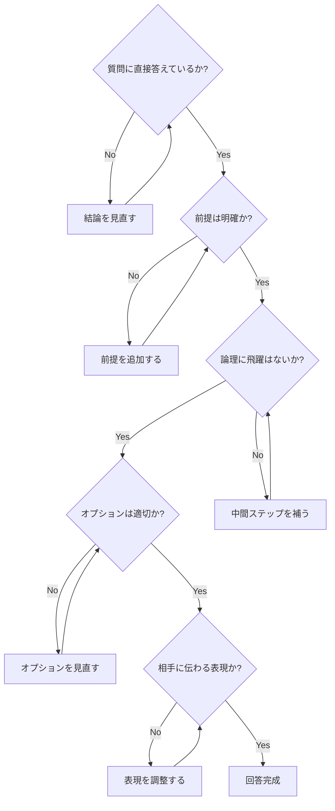

## 第5章 注意事項

### 5-1. 本章の目的

CASLSは強力なフレームワークだが、使い方を誤ると逆効果になる場合がある。本章では、フレームワーク使用時に留意すべき点を整理する。

### 5-2. 全般的な注意事項

|No.|注意事項|説明|
|---|---|---|
|1|完璧を目指しすぎない|すべての要素を毎回使う必要はない。「適切な回答」が目標であり「完璧な回答」ではない|
|2|形式に囚われすぎない|フレームワークは道具であり目的ではない。内容が伴わなければ意味がない|
|3|相手に合わせる|専門家相手と初心者相手では、同じ質問でも回答の深さや表現を変える|
|4|時間とのバランス|簡単な質問に過剰な構造化は不要。シンプル版で十分な場合も多い|
|5|柔軟に順序を変える|コア要素の順序は目安であり、文脈に応じて入れ替えても良い|

### 5-3. コア要素に関する注意事項

#### 5-3-1. 結論（端的に）の注意点

|問題|説明|対策|
|---|---|---|
|結論の先送り|前置きが長く、結論がなかなか出てこない|最初の1〜2文で答えを述べる習慣をつける|
|曖昧な結論|「場合による」「一概には言えない」で終わる|条件を明示した上で、条件ごとの結論を述べる|
|結論の不在|質問に直接答えていない|「質問は何か」を再確認してから回答する|

#### 5-3-2. 前提の注意点

|問題|説明|対策|
|---|---|---|
|前提の省略|暗黙の前提に依存している|「何を前提としているか」を常に明示する|
|前提の過剰|前提が多すぎて本題に入れない|重要な前提に絞り、細かい前提は必要時に補足|
|前提の押しつけ|相手が同意していない前提を使う|前提の妥当性を確認するか、複数の前提で場合分け|

#### 5-3-3. 理由・論理の注意点

|問題|説明|対策|
|---|---|---|
|論理の飛躍|AからBへの繋がりが不明|中間ステップを明示する|
|循環論法|AだからB、BだからAになっている|論証の出発点を確認し、独立した根拠を示す|
|感情的論証|論理ではなく感情に訴えている|感情と論理を分離し、論理部分を明確にする|
|権威への訴え|「偉い人が言ったから正しい」|権威の意見も根拠として検証する|

#### 5-3-4. 結論（詳細版）の注意点

|問題|説明|対策|
|---|---|---|
|端的な結論との矛盾|詳細版で違うことを言っている|両者の一貫性を確認する|
|詳細すぎる|情報過多で要点が埋もれる|重要度で優先順位をつけ、詳細は付録に回す|
|抽象的すぎる|具体性がなく実践に使えない|具体例、数値、手順を含める|

#### 5-3-5. 総括の注意点

| 問題      | 説明           | 対策                       |
| ------- | ------------ | ------------------------ |
| 新情報の追加  | 総括で新しい主張を始める | 総括は既出内容のまとめに限定する         |
| 単なる繰り返し | 結論と同じことを言うだけ | 要点整理、示唆、次のステップなど付加価値を加える |
| 尻切れトンボ  | 締めくくりがない     | 「まとめると」「重要なのは」等で明確に締める   |

### 5-4. オプション要素に関する注意事項

#### 5-4-1. 選択に関する注意点

|問題|説明|対策|
|---|---|---|
|過剰な使用|全オプションを毎回使おうとする|質問に本当に必要なものだけを選ぶ|
|不適切な選択|質問タイプに合わないオプションを使用|4-5の選択ガイドを参考にする|
|オプション依存|コア要素が不十分なままオプションに頼る|まずコア要素を固めてからオプションを追加|

#### 5-4-2. 論理・検証系（A, F, G/P, H, I）の注意点

|問題|説明|対策|
|---|---|---|
|過度な懐疑|何も主張できなくなる|実用的な確実性の基準を設ける|
|検証レベルの誤認|推論を事実として提示|G/Pの段階を常に意識する|
|整合性の過信|「説明できる＝正しい」と思い込む|Hを使って整合性と検証を区別する|
|偽の精度|根拠なく確率を数値化する|Pモードは数値根拠がある場合のみ使用|

#### 5-4-3. 比較・選択系（B, D, S）の注意点

|問題|説明|対策|
|---|---|---|
|不公平な比較|一方に有利な観点だけで比較|両者に公平な観点を設定する|
|偽の二択|他の選択肢を無視している|「他にも選択肢がないか」を確認する|
|比較軸の不明確|何を基準に比較しているか不明|比較の観点を明示する|
|安易な統合|いいとこ取りが中途半端な折衷案に|統合の根拠と失われるものを明示する|

#### 5-4-4. 補足・深掘り系（C, E, K）の注意点

|問題|説明|対策|
|---|---|---|
|根拠の質|信頼性の低い情報を根拠にする|情報源の信頼性を評価する|
|考察の暴走|事実から離れすぎた思索|事実との接点を維持する|
|分類の恣意性|分類基準が不明確|分類の基準と目的を明示する|

#### 5-4-5. 文脈・認識系（J, L, M, N, O, T）の注意点

|問題|説明|対策|
|---|---|---|
|注意点の過剰|注意ばかりで前に進めない|重要度で優先順位をつける|
|歴史の偏り|特定の視点からの歴史のみ|複数の視点を考慮する|
|定義への固執|定義論争で本題が進まない|「この議論ではこの定義で進める」と宣言する|
|価値判断の隠蔽|価値判断を事実として提示|「〜すべき」には必ず根拠と立場を明示|
|省略の乱用|「省略しました」を免罪符に|省略は必要最小限に、理由を明示|
|鮮度の過信|耐用期間の見積もりが甘い|不確実な場合は幅を持たせる|

#### 5-4-6. リバーシブル仕様に関する注意点

|問題|説明|対策|
|---|---|---|
|モード選択ミス|不適切なモードを選択|切り替え基準を確認する|
|併用の混乱|GモードとPモードの関係が不明確|併用時は両者の関係を明示する|
|反証不可能性の見落とし|検証できない主張を科学的と誤認|F要素で常に反証可能性をチェック|

### 5-5. フレームワーク自体の限界

CASLSにも以下の限界がある。

|限界|説明|
|---|---|
|創造性の制約|構造化は創造的な発想を制限する場合がある|
|形式主義の罠|形式を整えることが目的化するリスク|
|万能ではない|感情的なサポートが必要な場面など、構造化が不適切な場合もある|
|学習コスト|全要素を使いこなすには習熟が必要|
|時間コスト|丁寧に適用すると時間がかかる|

### 5-6. 適切な使用のためのチェックリスト

回答作成後、以下を確認する。

### 5-7. 本章のまとめ

|ポイント|内容|
|---|---|
|道具として使う|フレームワークは目的ではなく手段|
|柔軟に適用する|状況に応じて要素を取捨選択する|
|内容を重視する|形式よりも内容の質を優先する|
|継続的に改善する|使いながらフィードバックを得て改善する|
|リバーシブル仕様を活用する|F, G/Pは状況に応じてモードを切り替える|

---
